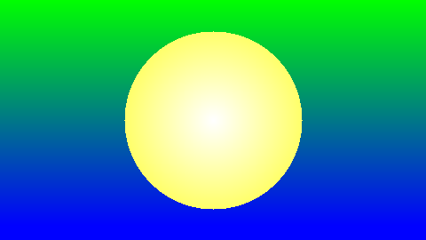

# Aufgabe 1

Hier soll anstatt des vorgegebene Quadrates eine Kreisscheibe dargestellt werde. Der Hintergrund 
soll einen vertikalen Farbverlauf 2er Farben beinhalten.

## Bild




## Lösung

Die Methode colorForRedSquareOnBlue änderte ich folgendermaßen ab:

```java
static int colorForRedSquareOnBlue( int x, int y )
	{
		int size = 100;
		double range = calculateRange(x, y);
		if ( pixelInsideOfCircle(size, range) )
		{
			drawGradientAfterFigure = true;
			circleColor = 255 - (int) (Math.sqrt(range) * 1.5);
			return new Color(255, 255, circleColor).getRGB();
		}
		else
		{
			// Beginn einer neuen Spalte
			if ( lastX != x )
			{
				lastX = x;
				green = 255;
				blue = 0;
			}

			// Farbverlauf setzt im unteren Bereich der gezeichneten Figur fort
			if ( drawGradientAfterFigure )
			{
				drawGradientAfterFigure = false;
				blue = y;
				green = 255 - y;
			}
			green = green - 1 > 0 ? --green : 1;
			blue = blue + 1 < 255 ? ++blue : 255;
			return new Color(0, green, blue).getRGB();
		}
	}
```

### 1.4: vertikaler Hintergrund Verlauf

Ich wählte einen linearen, vertikalen Farbverlauf von Grün nach Blau. Dafür legte ich 
2 Variablen: green und blue fest. green bekam den Startwert von 255 und blue 0. In jedem Schritt auf 
der Y-Achse subtrahierte ich von dem green-Wert 1 und addierte den blue-Wert um 1. Bei Beginn einer neuen Spalte
setzte ich die beiden Werte auf ihre Ausgangswerte zurück. Damit nun der Verlauf auch unterhalb der Figur gezeichnet
wird, setzte ich ein boolean, falls ein Pixel mit der Farbe der Figur gezeichnet wurde. Falls dann wieder
ein Pixel nicht von der Figur gezeichnet wird, wird die Differenz von 255 und dem aktuellen Y-Wert als green-Wert
genommen und der aktuelle Y-Wert als blue-Wert.

### 1.5: Kreisscheibe


Für diese Aufgabe bediente ich mich einer Formel(siehe Quellen), um zu überprüfen, ob der aktuelle Pixel innerhalb des 
Kreises liegt. Den Mittelpunkt des Kreises legte ich auf genau die Hälfte der Höhe und der Breite und der Radius
beträgt 100. Zusätzlich habe ich einen Kreisverlauf von Gelb nach Weiß realisiert. Je näher der Pixel an dem
Mittelpunkt liegt, desto weißer wird er. Ich rechnete aus auf welchem Radius der Pixel lag, nahm den Wert 
(zwischen 0 und 100) und multiplizierte ihn mit 1,5(so fand ich, sah es schöner aus und damit der Wert nicht über 255 geht).

## Quellen

Für die Formel nutzte ich diese Quelle: http://www.mathe-schule.de/download/pdf/Mathematik/Kreise.pdf
