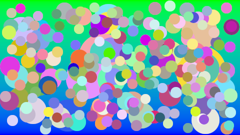
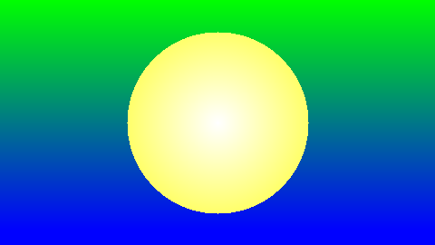
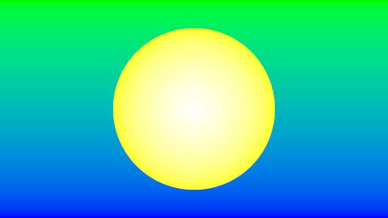

# Aufgabe 2

Implementierung der Gammakorrektur und Antialiasing mithilfe des Stratified Sampling 

## Bild



## Lösung

### Allgemeines: 

Um das Prinzip der Objektorientierung einzubringen, erstellte ich insgesamt 4 Klassen: 


ImageCreator     -  Ist für den grundlegenden Ablauf zuständig, beinhaltet finale Variablen, wie z.B. Outputname oder Größe  
GammaCorrection  -  Zusammenstellung einiger hilfreichen Methoden für die Korrektion des Gammawertes  
Sampling         -  Beinhaltet die Logik für das Stratified Sampling  
Circle           -  Ein abstrakter Datentyp für die Kreisscheibe, beinhaltet Attribute, wie Position oder Farbe  

Die Iterationsschleife für alle Pixel sieht so aus:

```java
for ( int x = 0; x != width; x++ )
		{
			for ( int y = 0; y != height; y++ )
			{
				Color color = sampling.stratifiedSampling(x, y);
				color = gammaCorrection.correct(color);
				image.setRGB(x, y, color.getRGB());
			}
		}
```

### 2.1: Gammakorrektur

In der GammaCorrection Klasse besitzt die Variable gamma den Standardwert von 2,2. Dieser kann bei Bedarf geändert werden. 
In der Klasse sind unter anderem diese beiden Methoden:

```java
	public int correctWithIntensity( double intensity )
	{
		return (int) Math.floor(Math.pow(intensity, 1 / gamma) * 255);
	}

	public int correct( double colorValue )
	{
		return (int) Math.floor(Math.pow(colorValue / 255, 1 / gamma) * 255);
	}
```

Die beiden Methode spiegeln die Formel: n = &#x230A; I^(1/gamma)*N &#x230B; wieder. 
Dabei wird die Intensität oder der aktuelle Farbwert genommen und mit dem gammawert verrechnet. Das Ergebnis ist dann ein gammakorregierter Farbwert.
Da das Ergebnis ein double ist, wird mit Math.floor() auf einen Integer-Wert abgerundet.

### 2.2: Supersampling

  




Die Stratified Sampling Methode besitzt eine Abtastrate von 100, kann jedoch auch abgeändert werden.
Die Methode sieht folgendermaßen aus:

```java
	public Color stratifiedSampling( int x, int y )
	{
		int summeRed = 0;
		int summeGreen = 0;
		int summeBlue = 0;

		for ( int xi = 0; xi < abtastRate; xi++ )
		{
			for ( int yi = 0; yi < abtastRate; yi++ )
			{
				double rx = Math.random();
				double ry = Math.random();
				double xs = x + (xi + rx) / abtastRate;
				double ys = y + (yi + ry) / abtastRate;
				Color rgb = pixelColor(xs, ys);
				summeRed += rgb.getRed();
				summeGreen += rgb.getGreen();
				summeBlue += rgb.getBlue();
			}
		}
		summeRed /= abtastPunkte;
		summeGreen /= abtastPunkte;
		summeBlue /= abtastPunkte;

		return new Color(summeRed, summeGreen, summeBlue);
	}
```

Mithilfe der Methode pixelColor() werden die Farbwerte des Pixels ermittelt und summiert. Nach der for-Schleife werden die Durchschnitte der Farbwerte berechnet.
Zum Schluss wird eine neue Color mit den entsprechenden Farbwerten an die main zurückgegeben. Anschließend durchlaufen die Farbwerten die gamma Korrekturmethoden.


### 2.3: Viele Kreisscheiben


Einen Kreis erzeuge ich mit der Klasse Circle, dabei gibt es einen Konstruktor für die zufällige Berechnung der Attribute(Position, Radius und die RGB-Werte).
Alle Kreise, die gezeichnet werden sollen, sammle ich in einer Liste. Es kommen jedoch nur die Kreise in die Liste, die die Zusatzbedingung erfüllen. Sie lautet:
 
Kein größerer Kreis soll einen kleineren komplett oder teilweise überdecken.

Um das zu erreichen, erstelle ich die Kreise hintereinander und überprüfe, ob der neue Kreis diese Bedingung verletzt(circle.circleCollision()). Wenn ja, dann werden neue Attributwerte generiert 
(newCircle.generateAttributes()) und die Überprüfung beginnt von vorne. Dafür verwende ich eine while-Schleife, die solange über die Liste iteriert, bis die Bedingung bei keinem Kreis missachtet wird.

```java
	public void randomCircleCreation( int numberOfCircles )
	{
		for ( int i = 0; i < numberOfCircles; i++ )
		{
			Circle newCircle = new Circle(480, 270);
			boolean loop = true;

			while ( loop )
				loop = checkAllCircles(newCircle);

			circleList.add(newCircle);
		}
	}

	private boolean checkAllCircles( Circle newCircle )
	{
		for ( Circle circle : circleList )
			if ( circleCollision(newCircle, circle) )
			{
				newCircle.generateAttributes();
				return true;
			}
		return false;
	}
```

Die Überprüfung, in welcher Beziehung zwei Kreise liegen, wird anhand folgender Methode festgestellt:

```java
	private boolean circleCollision( Circle newCircle, Circle circle )
	{
		double abstandX = Math.pow(Math.abs(newCircle.getX() - circle.getX()), 2);
		double abstandY = Math.pow(Math.abs(newCircle.getY() - circle.getY()), 2);
		double abstand = Math.sqrt(abstandX + abstandY);

		int radiusDifferenz = Math.abs(newCircle.getRadius() - circle.getRadius());
		int radiusSum = newCircle.getRadius() + circle.getRadius();
		boolean newCircleIsBigger = newCircle.getRadius() >= circle.getRadius();

		if ( sameCenter(abstand) && newCircleIsBigger )
			return true;
		else if ( nestedCircle(abstand, radiusDifferenz) && newCircleIsBigger )
			return true;
		else if ( twoIntersectionPoints(abstand, radiusDifferenz, radiusSum) && newCircleIsBigger )
			return true;
		return false;
	}
```

Es gelten folgende Deklarationen:

d  = Abstand zwischen den Mittelpunkten
```java
double abstandX = Math.pow(Math.abs(newCircle.getX() - circle.getX()), 2);
double abstandY = Math.pow(Math.abs(newCircle.getY() - circle.getY()), 2);
double abstand  = Math.sqrt(abstandX + abstandY);
```
r1 = Radius des schon vorhandenen Kreises  
r2 = Radius des neuen Kreises

3 Lagebeziehungen von 2 Kreisen haben sich herauskristallisiert:

1. d = 0                    :  gleicher Mittelpunkt
2. d <= |r1 - r2|           :  Kreise liegen ineinander
3. |r1 - r2| < d < r1 + r2  :  Kreise schneiden sich in genau 2 Punkten

Falls der Radius des neuen Kreises größer ist, als der des schon vorhandenen, dann würde eine komplette oder teilweise Überdeckung eintreten.  
Weiterhin verändert sich die Methode pixelColor des Stratified Sampling. Dort wird über die Kreisliste iteriert und geprüft, ob die angegebene Position innerhalb des Kreises liegt. 
Wenn das der Fall ist, wird die Farbe temporär gespeichert und überprüft, ob sich noch ein anderer Kreis an oberster Ebene befindet. Am Ende der Iterationen bleibt die Farbe der obersten Ebene übrig. 
Die Farbe wird an das Stratified Sampling zurückgegeben, um daraus den Mittelwert berechnen zu können. Anschließend wird eine gamma Korrektur vorgenommen und der nächste Pixel folgt.

## Quellen

http://abizehn.de/Methodentage/Station%20Gegenseitige%20Lage%20zweier%20Kreise/Station%20Gegenseitige%20Lage%20zweier%20Kreise%20Loesung.htm
