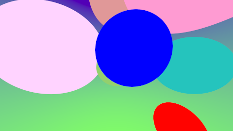

# Aufgabe 4: Strahlschnitte

Implementierung vom Background, Spheres und Groups mithilfe des Composite Patterns

## Bild



## Lösung

### Allgemein

Man kann die Hauptklasse ImageCreator instanziieren und sämtliche Einstellungen entweder schon im Konstruktor oder anschließend über Methoden dieser Instanz festlegen.
Unter anderem kann man die angezeigten Objekte mit der Methode setScene(Shape shape) festlegen. Danach ruft man die Methode start() auf und erzeugt damit das Bild. Anschließend kann man das Bild
über die Methode save(String filename) speichern . Folgende Einstellungen sind momentan möglich:  
1. Bildgröße (Höhe und Breite)
2. Abtastrate für Stratified Sampling (wird immer verwendet)
3. Speicherung der Farbcomponenten in 8- oder 16 Bit-Variante (erfolgt über die Auswahl des ImageQualityEnum)
4. Erzeugung und Berechnung des Bildes mit Strahlen (useRayTracing)
5. die angezeigten Objekte (setScene() )
6. Die RandomKreisErzeugung für Aufgabe a02
7. den Gamma-Wert (Standard ist 2,2)

Die Einstellungen werden bei Bedarf weiter an die zugehörigen Klassen geleitet, z.B die Setzung des Gamma-Wertes.

Da es zu Fehler kommen kann z.B. wenn man versucht ein Bild zu erzeugen, obwohl die Scene noch nicht gesetzt wurde, erstellte ich Exceptions, die bei Bedarf geworfen werden. Das heißt auch, dass in der jeweiligen Main
gegebenefalls die Aufrufe einiger Methoden von der ImageCreator Klasse einen try-catch Block benötigen oder die Exception weiter leiten.

### 4.1: Strahl, Form und Treffer


Das Interface Shape sieht folgendermaßen aus:

```java
public interface Shape
{
	public Hit calculateHit( Ray ray );
}
```

Die einzelnen Objekte werden alle dieses Interface implementieren. Als Ergebnis wird ein Hit zurückgegeben:

```java
public class Hit
{
	public final double t;
	public final Vec3 position;
	public final Vec3 color;

	public Hit( double t, Vec3 position, Vec3 color )
	{
		this.t = t;
		this.position = position;
		this.color = color;
	}
}
```


### 4.2: Strahlschnitt: Hintergrund

Die Klasse implementiert das Shape Interface. Die Schnittposition ist in der Unendlichkeit, da es jedoch entscheidend ist ob der jeweilige Wert positiv oder negativ unendlich ist, multipliziere ich den aktuellen Werte des Strahls
mit positiv Unendlich. Falls der Strahlwert 0 ist, wird das positive Unendlich zurückgegeben. Dadurch ist das passende Vorzeichen sichergestellt.

Einen Farbverlauf habe ich durch die lineare Interpolation 2er Farbvektoren erreicht. Der folgende Codeausschnitt zeigt die entsprechende Rechnung:

```java
	double t = direction.y + .5;

	Vec3 color =  one.scale(1 - t).add(two.scale(t));
```

### 4.3: Strahlschnitt: Kugel

Die Kugel besitzt als Attribute den Mittelpunkt und die Farbe in Form von Vektoren, sowie den Radius. 

die zu implementierende Methode aus dem Interface sieht so aus:

```java
	@Override
	public Hit calculateHit( Ray ray )
	{
		double p = ray.direction.scale(2).skalarProduct(ray.origin.sub(center));
		Vec3 tr = ray.origin.sub(center);
		double q = tr.skalarProduct(tr) - Math.pow(radius, 2);

		double diskriminante = Math.pow(p / 2, 2) - q;

		if ( diskriminante < 0 )
			return null;

		double k = -(p / 2);
		double sqrt = Math.sqrt(Math.pow(p / 2, 2) - q);
		double t1 = k + sqrt;
		double t2 = k - sqrt;
		double t = t1 <= t2 ? t1 : t2;

		Vec3 position = ray.origin.add(ray.direction.scale(t));
		if ( t < 0 )
			return null;
		return new Hit(t, position, color);
	}
```

Dabei wird nach dem Vorgehen aus der Vorlesung vorgegangen. Es gibt 3 Varianten, welches Ergebnis zurückgegeben wird. Entweder der Strahl trifft nicht,
dann wird null zurückgegeben, der Strahl trifft genau einmal oder der Strahl trifft 2 mal. Letzters wird der Treffer mit dem kleineren t zurückgegeben.

### 4.4: Strahlschnitt: Gruppe von Formen

Die Gruppe verwaltet eine ArrayList<Shape> und bei dem Aufruf der Methode calculateHit wird iterativ durch die Liste gegangen. Falls in der Liste wieder eine Group ist, wird in der neuen Group ebenfalls iterativ 
durch die Liste gegangen. Somit ist der Aufruf dieser Methode rekursiv. Es wird eine neue Liste von Hits erstellt und dort werden alle Hits gesammelt und anschließend mit einem Comporator nach dem kleinstem t sortiert.
Falls eine Shape Implementierung null zurückgibt, wird diese nicht der Liste hinzugefügt. Das erste Objekt der sortierten Liste wird zurückgegeben. Ist die Liste jedoch leer(es befindet sich nur eine Sphere in der Liste),
wird bei keinem Treffer eine Standardfarbe genommen. Die Standardfarbe ist schwarz, man kann jedoch auch über die ImageCreator Klasse die Standardfarbe ändern.

```java@Override
	public Hit calculateHit( Ray ray )
	{
		List<Hit> list = new ArrayList<>();
		for ( Shape shape : shapes )
		{
			Hit h = shape.calculateHit(ray);
			if ( h != null )
				list.add(h);
		}
		if ( list.size() > 1 )
			list.sort(( hit1, hit2 ) ->
			{
				return Double.compare(hit1.t, hit2.t);
			});

		if ( list.isEmpty() )
			return null;
		return list.get(0);
	}
```

### 4.5: Unbeleuchtete Szene


Bei der Erzeugung einer ImageCreator Instanz werden schon einige Einstellungen eingestellt:

```java
ImageCreator creator = new ImageCreator(width, height, abtastRate, ImageQualityEnum.Bit16, true);

		try
		{
			creator.setScene(createScene());
			creator.start();
		} catch( FeatureNotUsingException e1 )
		{
			e1.printStackTrace();
		} catch( NoSceneException e )
		{
			e.printStackTrace();
		}

		try
		{
			creator.savePicture(name);
		} catch( IOException e )
		{
			e.printStackTrace();
		}
	}
```

Zudem wird die Scene gesetzt mit einem Background, 8 Spheres und 1 Group:

```java
	private Shape createScene()
	{
		Shape bg = new Background();

		Vec3 center = new Vec3(0, 0, -50);
		Vec3 color = new Vec3(.3, .63, .153);
		Shape sphere = new Sphere(center, 15, color);

		Vec3 center2 = new Vec3(50, 0, -50);
		Vec3 color2 = new Vec3(.015, .561318664, .5165651);
		Shape sphere2 = new Sphere(center2, 20, color2);

		Vec3 center3 = new Vec3(0, 50, -50);
		Vec3 color3 = new Vec3(.751235131, .321351, .3216515);
		Shape sphere3 = new Sphere(center3, 20, color3);

		Vec3 center4 = new Vec3(-40, 10, -52);
		Vec3 color4 = new Vec3(1., .65481, 1.);
		Shape sphere4 = new Sphere(center4, 30, color4); 
		
		Vec3 center5 = new Vec3(2, 2, -10);
		Vec3 color5 = new Vec3(.0, .0, 1.);
		Shape sphere5 = new Sphere(center5, 5, color5);

		Vec3 center6 = new Vec3(10, 15, -8);
		Vec3 color6 = new Vec3(.984651, .333333, .65313135);
		Shape sphere6 = new Sphere(center6, 10, color6);

		Vec3 center7 = new Vec3(30, -30, -33);
		Vec3 color7 = new Vec3(1., .0001, 0);
		Shape sphere7 = new Sphere(center7, 10, color7);

		Shape group = new Group();
		((Group) group).addAllShape(bg, sphere, sphere2, sphere3, sphere4, sphere5, sphere6, sphere7);

		return group;
	}
```
## Quellen