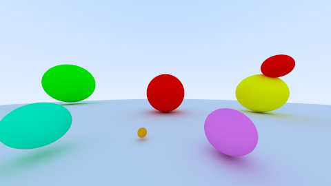

# Aufgabe 5: Reflexion

Implementierung vom Material und rekursiver Strahlverfolgung

## Lösung

### Allgemein


Ich habe jetzt bei der ImageCreator Klasse eine Methode eingebaut, wo momentan 3 Threads die Berechnungen ausführen. Dabei werden Objekte, wie die Sampling Instanz oder der BufferedWriter für das Image übergeben.
Die Threads fangen bei unterschiedlichen Reihen an und auf, sodass die Gefahr der Überlappung gering ist. Zusätzlich habe ich eine Ausgabe eingebaut, die bei 25%, 50% und 75% des Fortschritts eines Threads in die
Konsole schreibt und den Status bekannt gibt.


### 5.1: Material


Das Interface Material sieht folgendermaßen aus:

```java
	public interface Material
	{
		public Ray getScatteredRay( Hit hit );
	
		public Vec3 getAlbedo();
	
		public boolean isScattered();
	
		Vec3 getEmission( Ray ray );
	}
```

Die 2 konkreten Implementiereungen lauten dann PerfectDiffuseMaterial und BackgroundMaterial.


### 5.2: Umbauarbeiten


Das Interface des Shapes bekommt jetzt 2 Methoden mehr: einen Setter und einen Getter für das Material. Im Konstruktor jeder Implementierung von Shape, außer die Group, muss nun ein Material gesetzt werden.
Zusätzlich bekommt die Hit Klasse ein Attribut mehr: Die Oberflächennormale. Diese wird benötigt, um die zufällige Richtung zu berechnen. Da die Oberflächennormale bei jedem Shape anders sein kann, ist es notwendig, diese anzugeben.

### 5.3: Rekursive Strahlverfolgung


Die Implementierung der Methode sieht in meinem Fall so aus:

```java
	private Vec3 radiance( Ray ray, int depth )
	{
		Hit hit = scene.calculateHit(ray);
		if ( hit == null )
			return defaultColor;
		Vec3 emission = hit.material.getEmission(ray);
		if ( hit.material.isScattered() && depth > 0 )
		{
			return emission.add(radiance(hit.material.getScatteredRay(hit), depth - 1).scaleAll(hit.material.getAlbedo()));
		}
		return emission;
	}
```

Die Abfrage, ob der Hit null ist, ist aus Sicherheitsgründen eingebaut. Im Normalfall tritt dieser Fall nicht ein. Ein Spezialfall wäre z.B. wenn kein Hintergrund definiert wurde.
Als nächstes wird überprüft, ob der Strahl gestreut wird. Wenn ja, dann beginnt die Rekursion mit anschließender Berechnung. Sollte der Shape nicht gestreut werden wird die Emission des Shapes zurückgegeben.

### 5.4: Perfekt diffuses Material


Dieses Material gibt keine Emission ab und als Albedo wird die aktuelle Farbe des Shapes genommen.
Die Zufällige Streuungsrichtung wird folgendermaßen bestimmt:

```java
	@Override
	public Ray getScatteredRay( Hit hit )
	{
		Vec3 direction = null, randomPosition = null;
		boolean found = false;
		double x, y, z;
		while ( !found )
		{
			x = (Random.random() * 2.) - 1.;
			y = (Random.random() * 2.) - 1.;
			z = (Random.random() * 2.) - 1.;
			randomPosition = new Vec3(x, y, z);

			if ( randomPosition.skalarProduct(randomPosition) <= 1 )
			{
				found = true;
				direction = hit.surfaceNormal.add(randomPosition).normalize();
			}
		}
		return new Ray(hit.position, direction, 0, Double.POSITIVE_INFINITY);
	}
```

In einer While-Schleife wird geprüft, ob der erzeugte Punkt des 3-Dimensionalen Würfels innerhalb der Kugel liegt. Dieses Prinzip der Überprüfung nennt sich: "Monte Carlo Integration".
Da die Normale normalisiert ist, ist die Kugel eine Einheitskugel und der Würfel ein Einheitswürfel, sodass das die Bestimmung des neuen Punktes erleichtert.
Ist der zufällige Punkt nun innerhalb der Kugel, dann setzt sich die zufällige Richtung aus dem Normalenvektor und dem zufälligem Punkt zusammen.

### 5.5: Beleuchtete Szene

Das Ergebnis ist folgendes:




## Quellen