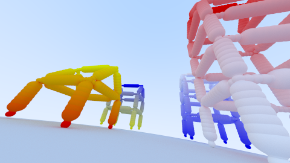

# Aufgabe 6: Bewegliche Kamera

Implementierung einer beweglichen Kamera mithilfe von Matrizen

## Lösung

### 6.1: Transformierbare Kamera

Die Kamera-Klasse bekommt nun eine Mat4 Variable transformation. Diese kann gesetzt oder es kann eine weitere Matrix hinzugefügt werden. Der Origin wird direkt bei Änderung der Transformationsmatrix mit transformiert. Die Richtung wird erst bei
Aufruf der Methode transformiert. Die Matrix kann über die ImageCreator-Klasse verändert werden.

```java
	public Ray generateRay( double x, double y, double lowerBound, double upperBound )
	{
		double x1 = x - width / 2;
		double y1 = height / 2 - y;
		double z1 = -((height / 2) / Math.tan(alpha / 2));
		Vec3 direction = new Vec3(x1, y1, z1).normalize();
		return new Ray(origin, transformation.transformDirection(direction), lowerBound, upperBound);
	}
```


### 6.2: Ansichten einer Szene

Als Szene hab ich mir die Ansicht von Häusern, welche nur aus Kugel bestehen, ausgesucht. Um das Haus darzustellen, habe ich eine neue Klasse erstellt, welche alle beteiligten Kugeln eines Hauses in einer Gruppe sammelt, weswegen
die Klasse auch von einer Gruppe erbt. Die Intersect Methode bleibt nämlich gleich. 
Ein Konstruktor für die Klasse HouseOfCircles sieht folgendermaßen aus:

```java
public HouseOfCircles( Vec3 dimensions, int levels, double roofHeight, Vec3 start, double radius, Vec3 colorOne, Vec3 colorTwo, Mat4 transformation );
```

1. dimensionn bestimmt die Ausmaße des Hauses
2. levels gibt an, wie viele Etagen das Haus besitzen soll
3. roofHeight beschreibt, wie hoch nur die Höhe des Daches sein soll
4. start ist der Startpunkt des Hauses, dieser ist die linke untere Ecke
5. radius ist der Radius jeder einzelnen Kugeln
6. colorOne ist für die lineare Interpolation die Startfarbe
7. colorTwo ist für die lineare Interpolation die Endfarbe (optional)
8. transformation ist die Transformationsmatrix (optional)

Als nächstes kann man auswählen, ob man ein Haus mit Farbverlauf oder ohne erstellen möchte. Der Unterschied liegt bei der Farbe.
Wenn die 2. Farbe null ist, kann keine lineare Interpolation durchgeführt werden, deswegen hier die Prüfung. Aus irgendeinem Grund, muss ich den Startpunkt um eine Radiuseinheit nach unten verschieben. Vielleicht liegt das auch an der Oberfläche der "Erde".
Als nächstes rechne ich durch lineare Interpolation die Farbe aus, wo das Dach anfängt. Dafür berechne ich das Verhältnis zwischen der Dachhöhe und der gesamten Haushöhe aus. Danach wird die Basis(alle einzelnen Etagen) und das Dach in einer neuen Gruppe
erzeugt und der aktuellen Gruppe hinzugefügt.

```java
	public HouseOfCircles createRadiantHouse()
	{
		if ( colorTwo == null )
			return createHouse();

		start = start.sub(0, radius, 0);
		Vec3 colorSection = dimensions.y != 0.
				? colorOne.scale((roofHeight / dimensions.y)).add(colorTwo.scale(1 - (roofHeight / dimensions.y)))
				: colorTwo;
		Group basis = createBasis(colorOne, colorSection);
		Group roof = createRoof(colorSection, colorTwo);
		if ( basis != null )
			addShape(basis);
		if ( roof != null )
			addShape(roof);

		return this;
	}
```

Wenn die level Variable gleich 0 ist, dann sind keine Etagen zu erstellen, deswegen hier ein "return null;".
Die Punkte kann man sich so von oben betrachtet in der untere Ebene wie folgt vorstellen:  
D  .  C  
.  .  .  
A  .  B  

in der oberen Ebene:  
H  .  G  
.  .  .  
E  .  F  

Als nächstes berechne ich ausgehend vom Startvektor die 4 unteren Fußpunkte. In der Variable singleLevelHeight speicher ich die Höhe einer Etage. Mit verticalCount bzw horizontalCount1 und horizontalCount2 berechne ich die ungefähr notwendigen 
Kugeln im Verhältnis zum Radius, damit es bei längeren oder kürzeren Distanzen einigermaßen gut aussieht. Innerhalb einer forschleife, welche die einzelnen Etwagen hochzählt, erstelle ich Vektoren für die oberen Punkte. Auch hier berechne 
ich mithilfe der linearen Interpolation den Farbwert für eine Etage und gebe diese Farbe als Parameter zur Methode "createLine" mit. Dann werden die einzelnen horizontalen und vertikalen Linien zwischen den Start- und Endpunkten 
mit Kugeln in einzelnen Gruppen gebildet. Zum Schluß werden nun die oberen Endpunkte zu den unteren Fußpunkten der nächsten Ebene.


```java
	private Group createBasis( Vec3 colorOne, Vec3 colorTwo )
	{
		if ( levels == 0 )
			return null;
		Group gr = new Group();
		Vec3 a = start;
		Vec3 b = a.add(dimensions.x, 0, 0);
		Vec3 c = a.add(dimensions.x, 0, -dimensions.z);
		Vec3 d = a.add(0, 0, -dimensions.z);
		Vec3 colOne = colorOne;
		Vec3 colorSection;
		double singleLevelHeight = (dimensions.y - roofHeight) / levels;
		int verticalCount = radius != 0. ? (int) Math.floor((singleLevelHeight / radius) * 1.5) : 5;
		int horizontalCount1 = radius != 0. ? (int) (Math.floor(Math.abs(dimensions.z) / radius) * 1.5) : 5;
		int horizontalCount2 = radius != 0. ? (int) Math.floor((Math.abs(dimensions.x) / radius) * 1.5) : 5;

		for ( int i = 1; i < levels + 1; i++ )
		{
			Vec3 e = a.add(0, singleLevelHeight, 0);
			Vec3 f = a.add(dimensions.x, singleLevelHeight, 0);
			Vec3 g = a.add(dimensions.x, singleLevelHeight, -dimensions.z);
			Vec3 h = a.add(0, singleLevelHeight, -dimensions.z);

			colorSection = levels != 0.
					? colorOne.scale(1 - (i / (double) levels)).add(colorTwo.scale(i / (double) levels)) : colorTwo;

			// vertical
			Group g1 = createLine(a, e, colOne, colorSection, verticalCount);
			Group g2 = createLine(b, f, colOne, colorSection, verticalCount);
			Group g3 = createLine(d, h, colOne, colorSection, verticalCount);
			Group g4 = createLine(c, g, colOne, colorSection, verticalCount);

			// horizontal
			Group g6 = createLine(e, h, colorSection, horizontalCount1);
			Group g5 = createLine(h, g, colorSection, horizontalCount2);
			Group g7 = createLine(g, f, colorSection, horizontalCount1);
			Group g8 = createLine(f, e, colorSection, horizontalCount2);

			gr.addAllShape(g1, g2, g3, g4, g5, g6, g7, g8);
			a = e;
			b = f;
			d = h;
			c = g;
			colOne = colorSection;
		}
		return gr;
	}
```

Das Dach kann man sich so von oben in der unteren Ebene vorstellen:

H  .  G  
.     .  
E  .  F  
und so von der oberen Ebene:

.  .  .  
I  .  J  
.  .  .  

Zuerst wird geprüft, ob überhaupt ein Dach erstellt werden soll. Danach werden Die Punkte mithilfe der Dimension des Hauses berechnet. Auch hier werden im Verhältnis zum Radius die ungefähren benötigten Kugeln berechnet.
Danach werden die Linien zwischen den einzelnen Punkten gezeichnet.

```java
	private Group createRoof( Vec3 colorOne, Vec3 colorTwo )
	{
		if ( roofHeight == 0 )
			return null;
		Group gr = new Group();

		Vec3 e = start.add(0, dimensions.y - roofHeight, 0);
		Vec3 f = start.add(dimensions.x, dimensions.y - roofHeight, 0);
		Vec3 g = start.add(dimensions.x, dimensions.y - roofHeight, -dimensions.z);
		Vec3 h = start.add(0, dimensions.y - roofHeight, -dimensions.z);
		Vec3 i = start.add(0, dimensions.y, -dimensions.z / 2);
		Vec3 j = start.add(dimensions.x, dimensions.y, -dimensions.z / 2);
		int verticalCount = radius != 0. ? (int) Math.floor((e.sub(i).length / radius) * 1.5) : 5;
		int horizontalCount2 = radius != 0. ? (int) (Math.floor(Math.abs(dimensions.x) / radius) * 1.5) : 5;

		// rechts
		Group g9 = createLine(g, j, colorOne, colorTwo, verticalCount);
		Group g10 = createLine(f, j, colorOne, colorTwo, verticalCount);

		// links
		Group g11 = createLine(h, i, colorOne, colorTwo, verticalCount);
		Group g12 = createLine(e, i, colorOne, colorTwo, verticalCount);

		Group g13 = createLine(i, j, colorTwo, horizontalCount2);

		gr.addAllShape(g9, g10, g11, g12, g13);
		return gr;
	}
```

Nun, wie sieht "createLine" aus?

```java
private Group createLine( Vec3 start, Vec3 end, Vec3 colorOne, Vec3 colorTwo, int count )
	{
		Group gr = new Group();

		Vec3 center;
		Vec3 color;
		PerfectDiffuseMaterial material;
		for ( double i = 0.; i < 1.; i += (1. / count) )
		{
			center = start.scale(1 - i).add(end.scale(i));
			color = colorOne.scale(1 - i).add(colorTwo.scale(i));
			material = new PerfectDiffuseMaterial(color);
			Shape sphere9 = new Sphere(center, i < .20 || i > .80 ? radius * .5 : radius, material);
			gr.addShape(sphere9);
		}
		return gr;
	}
```

Als Parameter gebe ich den Start- un Endpunkt mit und errechne durch lineare Interpolation den Mittelpunkt der zu erstellenden Kugel.
Die forschleife berechnet den zu linear interpolierenden Wert zwischen 0 und 1. Deswegen wird auch das i um (1.0/count) hochgezählt.
Beim Radius hab ich noch eine Kleinigkeit verändert: Bis 20% und nach 80% der Strecke vom Anfang aus, werden die Kugeln mit dem halben Radius gezeichnet.
Das hat den Sinn, dass man die "Ecken" des Hauses besser erkennen kann.
In dieser CreateLine-Methode wird die Farbe auch per lineare Interpolation errechnet. Für die horizontalen Linien des Hauses bleibt die Farbe gleich,
deswegen gibt es auch eine Methode, wo in der Linie alle Kugeln diesselbe Farbe haben.





## Quellen