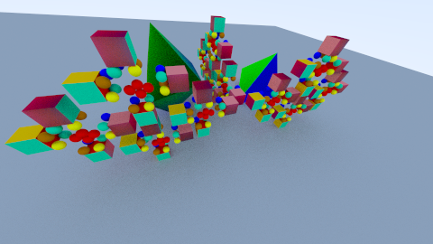
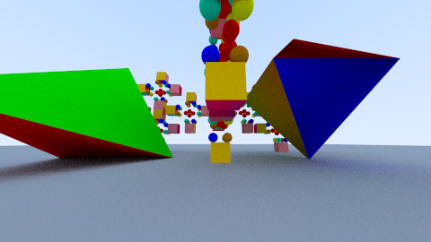
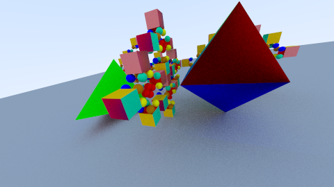
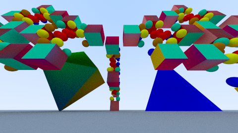

# Aufgabe 7: Instanziierung

Implementierung von beweglichen Objekten durch Transformationen sowie Instanziierung von Gruppen von Formen

## Lösung

### 7.0: Allgemeines 

#### 7.0.1: AbstractGroup

Ich entschied mich dazu, von der Gruppe eine Abstrakte Gruppe zu extrahieren. Das hatte den Hintergrund, dass ich eine Sammelklasse für primitive Formen haben haben wollte. Wenn ich einen Subtyp der vorherigen Gruppe genommen hätte, dann wären 
auch die ganzen Methoden, wie add... erreichbar gewesen, sodass ein zugriff auf die enthaltenen Elemente möglich ist. Wenn man eigene Formen bauen möchte kann man das immernoch durch die Gruppe machen. Das hat auch den Vorteil, dass ich nun
Arrays von den verwendeten Formen verwenden kann. In der AbstractGroup ist nun lediglich die Implementierung der Gruppenschnittpunktberechnung.

```java
	public abstract class AbstractGroup implements IntersectInterface
	{	
		protected ArrayList<IntersectInterface> shapes = new ArrayList<>();

		@Override
		public Hit calculateHit( Ray ray )
		{
			ArrayList<Hit> list = new ArrayList<>();

			for ( IntersectInterface shape : shapes )
			{
				Hit hit = shape.calculateHit(ray);
				if ( hit != null )
					list.add(hit);
			}
			list.sort(( hit1, hit2 ) ->
			{
				return Double.compare(hit1.t, hit2.t);
			});
			if ( list.isEmpty() )
				return null;
			return list.get(0);
		}
	}
```

#### 7.0.2: Interface Anpassung

Ich habe die Interfaces etwas abgeändert:
Das Interface IntersectInterface hat nur noch die Methode calculateHit. Die Methoden für das Material habe ich ausgelagert in ein eigenes Interface. Das IShapeMaterialSingle und IShapeMaterialMulti. Dabei besitzt das IShapeMaterialSingle
Methoden für die Verwaltung eines einzigen Materials und das IShapeMaterialMulti ist für mehrere ausgelegt. Beim Multi werden Arrays von Materialien verwendet und der Zugriff darauf. Die Sphere implementiert nun das IShapeMaterialSingle und das 
IntersectInterface, währenddessen z.B. die Ebene das IntersectInterface und das IShapeMaterialMulti implementiert. 

#### 7.0.3: weitere Formen

##### 7.0.3.1: Triangle

Um diese Form darzustellen, fand ich zuerst auf einer Qulle heraus, dass man eine Ebene erstellt und dann entlang jeder Seite prüft, ob der Punkt links von der gerade geprüften Seite sich befindet. Wenn das bei allen Seiten
der Fall ist, dann liegt der Punkt innerhalb des Dreieckes. Später fand ich den "Möller–Trumbore intersection algorithm". Dieser soll der schnellste Schnittpunktalgorithmus für das Dreieck sein. Also entschied ich mich diesen zu benutzen.

Die Klasse Triangle implementiert das IntersectInterface und das IShapeMaterialMulti. Im Konstruktor werden 3 Punkte jeweils in Form von Vektoren und die beiden Materialien für die Vorder- und die Rückseite übergeben. Dabei wird auch gleich die
Normale des Dreiecks berechnet.   
Die calculateHit Methode sieht folgendermaßen aus:

```java
	@Override
	public Hit calculateHit( Ray ray )
	{
		Vec3 p, q, distance;
		double determinant, inverseDeterminant, u, v;
		double t;

		// Begin calculating determinant - also used to calculate u parameter
		p = ray.direction.crossProduct(edge2);
		// if determinant is near zero, ray lies in plane of triangle or ray is
		// parallel to plane of triangle
		determinant = edge1.skalarProduct(p);
		// NOT CULLING
		if ( determinant > -EPSILON && determinant < EPSILON )
			return null;
		inverseDeterminant = 1. / determinant;

		// calculate distance from V1 to ray origin
		distance = ray.origin.sub(point1);

		// Calculate u parameter and test bound
		u = distance.skalarProduct(p) * inverseDeterminant;
		// The intersection lies outside of the triangle
		if ( u < 0. || u > 1. )
			return null;

		// Prepare to test v parameter
		q = distance.crossProduct(edge1);

		// Calculate V parameter and test bound
		v = ray.direction.skalarProduct(q) * inverseDeterminant;

		// The intersection lies outside of the triangle
		if ( v < 0. || u + v > 1. )
			return null;

		t = edge2.skalarProduct(q) * inverseDeterminant;

		if ( t > EPSILON )
		{ // ray intersection
			Vec3 position = ray.pointAt(t);
			if ( position == null )
				return null;
			boolean fromBack;
			if ( ray.origin.z < 0 )
				fromBack = ray.origin.z > position.z ? true : false;
			else
				fromBack = ray.origin.z < position.z ? true : false;
			return new Hit(t, position, fromBack ? normal.scale(-1) : normal, fromBack ? materials[1] : materials[0]);
		}

		// No hit, no win
		return null;
	}
```

##### 7.0.3.2: ConvexPolygon

Ein Konvexes Polygon kann nun erstellt werden. Die Klasse erbt von der AbstractGroup, da es eine Sammelklasse für einzelne Formen ist. Im Konstruktor können beliebig viele Punkte und Materialien übergeben werden. Das hat den Sinn, dass das
Polygon in einzelne Dreiecke aufgeteilt wird. möchte man nur ein einheitliches Material, dann kann man auch nur ein Material, welches für alle benutzt wird, erstellen. Da ein Polygon nur sichtbar ist, wenn es aus mindestens 3 Punkten besteht,
 erzeuge ich die Dreiecke nur, wenn die Anzahl der Punkte größer als 3 ist. Die Dreiecke werden ausgehend vom ersten Punkt erzeugt. Um das in einer Schleife bearbeiten zu können besteht das zu erzeugende Dreieck aus:  
1. Punkt1  
2. Punkt n+1  
3. Punkt n+2  
wobei n der Laufparameter ist und max. bis N - 2 läuft. (N = Anzahl der Punkte )  

Anschließend werden die erzeugten Dreiecke der AbstractGroup hinzugefügt, sodass die calculateHit Methode nicht überschrieben werden muss. 

```java
	public ConvexPolygon( Material material, Vec3... points )
	{
		if ( points.length > 2 )
		{
			surfaces = new Triangle[points.length - 2];
			for ( int i = 0; i < surfaces.length; i++ )
				surfaces[i] = new Triangle(points[0], points[i + 1], points[i + 2], material);
			for ( Triangle triangle : surfaces )
				shapes.add(triangle);
		}
	}
```
##### 7.0.3.3: Quader

Der Quader kann mit beliebiger Höhe, Breite und Tiefe erstellt werden. Der Quader besteht aus 6 Rechtecken, die ich so transformiert habe, dass ein Quader entsteht. Die Variante die ich erstellt habe ist bestimmt nicht die beste und schnellste,
aber es funktioniert. Der Quader wird im Urprung mit der Tiefe nach negativ z erstellt. Bei der Dimension des Quaders gibt man jedoch den positiven z Wert an. Es gibt wieder 2 Konstruktoren, einmal mit einem Material und einer mit allen Materialien.
Die Reihenfolge ist dabei folgende:  
1. Unten  
2. Oben  
3. vorne  
4. rechts  
5. hinten  
6. links  

Der Konstruktor sieht so aus:

```java
	public Quader( Vec3 dimension, Material material )
	{
		this.dimension = dimension;
		for ( int i = 0; i < surfaces.length; i++ )
		{
			if ( i < 2 )
			{
				surfaces[i] = new Rectangle(dimension.x, dimension.z, material);
				groups[i] = new Group(Mat4.rotateX(-90).mult(Mat4.translate(0, 0, (i * dimension.y))), surfaces[i]);
			}
			else
			{
				// vorne
				Mat4 m = Mat4.identity;
				double width = dimension.x;
				double height = dimension.y;
				switch ( i )
				{
					case 3:
						// rechts
						width = dimension.z;
						m = Mat4.translate(dimension.x, 0, 0).mult(Mat4.rotateY(90));
						break;
					case 4:
						// hinten
						m = Mat4.translate(0, 0, -dimension.z);
						break;
					case 5:
						// links
						width = dimension.z;
						m = Mat4.translate(0, 0, -dimension.z).mult(Mat4.rotateY(-90));
						break;
					default:
						break;
				}

				surfaces[i] = new Rectangle(width, height, material);
				groups[i] = new Group(m, surfaces[i]);
			}
		}
		for ( int i = 0; i < groups.length; i++ )
			shapes.add(groups[i]);
	}
	
```

#### 7.0.3.4: Platonische Körper
	
Es gibt 5 platonische Körper. Dabei sind alle Flächen aus regelmäßigen Polygonflächen. Einen davon ist der Würfel, welcher durch die Quader Klasse erstellbar ist.
	
#### 7.0.3.4a: Tetraeder
	
Der Tetraeder besteht aus 4 Dreiecken. Die Fläche ist jeweils ein gleichseitiges Dreieck. Daher kann man den höchsten Punkt, durch einsetzen der Höhenformeln, herausfinden. Der 1. Punkt ist der Ursprung, der 2. ist auf der x-Achse,
um die Seitenlänge versetzt zu finden. Um Punkt3 zu finden, kann man den Innradius berechnen und mal 3 nehmen, da der Mittelpunkt des Innenkreis die Höhe im Verhältnis 1:2 teilt. 

Die Berechnung der 4 Punkte findet im Konstruktor statt:

```java
	private void createRectangles()
	{
		Vec3 point1 = new Vec3(0, 0, 0);
		Vec3 point2 = point1.add(sideLength, 0, 0);

		double radiusInnen = sideLength / 6 * Math.sqrt(3);
		double hoehe = sideLength / 3. * Math.sqrt(6);
		Vec3 half = point2.sub(point1).scale(.5);
		Vec3 point3 = half.add(0, 3 * radiusInnen, 0);
		Vec3 point4 = half.add(0, radiusInnen, hoehe);

		surfaces[0] = new Triangle(point1, point3, point2, materials[0]);
		surfaces[1] = new Triangle(point1, point2, point4, materials[1]);
		surfaces[2] = new Triangle(point3, point1, point4, materials[2]);
		surfaces[3] = new Triangle(point2, point3, point4, materials[3]);

		for ( Triangle triangle : surfaces )
			shapes.add(triangle);
	}
```
	
	
#### 7.0.3.4b: Oktaeder

Der Oktaeder besteht aus 2 entgegengesetzten Pyrmaiden mit gelicher quadratischer Grundfläche. Die Höhe kann man durch einsetzen der Höhenformel errechnen und die hälfte der Diagonal ergibt den Mittelpunkt. 
Punkt 1-4 setzen bei mir die quadratische Grundfläche zusammen und der Vector center ist zuerst die untere Spitze Punkt 5 und danach die obere Spitze Punkt 6. Die Spitze ist der zentrale Punkt, welche
alle Dreiecke besitzen.

```java
	public Oktaeder( double sideLength, Material[] material )
	{
		if ( material.length != materials.length )
			throw new IllegalArgumentException();
		materials = material;

		this.sideLength = sideLength;
		double hoehe = (1. / 2) * Math.sqrt(3) * this.sideLength;
		double diagonale = Math.sqrt(2) * sideLength;

		Vec3[] points = new Vec3[4];
		points[0] = new Vec3(0, 0, 0);
		points[1] = points[0].add(sideLength, 0, 0);
		points[2] = points[0].add(sideLength, 0, -diagonale);
		points[3] = points[0].add(0, 0, -sideLength);
		Vec3 center = points[0].add(diagonale / 2, hoehe, -diagonale / 2);

		// zuerst unten
		for ( int i = 0; i < 4; i++ )
			surfaces[i] = new Triangle(center, points[(i + 1) % 4], points[i], materials[i]);

		center = center.add(0, -2 * hoehe, 0);
		for ( int i = 0; i < 4; i++ )
			surfaces[i + 4] = new Triangle(center, points[i], points[(i + 1) % 4], materials[i + 4]);

		for ( Triangle triangle : surfaces )
			shapes.add(triangle);
	}
```

### Aufgabe 7.1: Transformation und Inverse

Die Klasse Transformation verwaltet eine Transformationsmatrix und deren Inverse. Dafür gibt es folgende Methoden: 

```java
	public Transformation()

	public Transformation( Mat4 transformation )

	Mat4 get();

	Mat4 getInvert();

	void set( Mat4 transformation );

	void add( Mat4 transformation );

	void reset();

	Ray transformRay( Ray ray );

	Ray transformRayWithInvert( Ray ray );

	Hit transformHit( Hit hit );

	Hit transformHitWithInvert( Hit hit );
```

Im Standardkonstruktor wird die Matrix und die Inverse auf die Identität gesetzt. Im 2. Konstruktor wird die Inverse der Matrix berechnet und gesetzt, sodass mit den get- Methoden ein direkter Zugriff auf die Matrix bzw. die Inverse der Matrix möglich ist.
Die set Methode setzt die Matrix auf die übergeben Mat4 und berechnet die Inverse und setzt diese auch auf den berechnete Matrix. Die add Methode multipliziert die übergebene Matrix mit der vorhandenen Matrix. Reset setzt die Matrix und die 
Inverse auf die Identische Matrix zurück. Da man noch die Transformierung des Rays bzw. Hit braucht, sind diese in der Transformationsklasse implementiert. 

### Aufgabe 7.2: Transformierbare Shapes im Szenengraphen

Die Berechnung der eigentlichen Gruppe findet nun in der AbstractGroup statt(siehe Allgemeines). In der eigentlichen Group wird der Ray mithilfe der Inverse des erzeugten Transformationsobjektes transformiert. Dann wird der nächstliegende Schnittpunkt 
bestimmt und danach wird der Hit mit der normalen Matrix transformiert. Als Konstruktorparameter kann man nun die Matrix mitgeben, ansonsten wird die Identitätsmatrix genommen.

```java
@Override
	public Hit calculateHit( Ray ray )
	{
		Ray transformedRay = transform.transformRayWithInvert(ray);
		Hit hit = super.calculateHit(transformedRay);
		if ( hit == null )
			return null;
		return transform.transformHit(hit);
	}
```

### Aufgabe 7.3: Ebene

Um die erzeugte Ebene zu Beginn besser zu sehen und zu testen, wählte ich die Erzegung der XY-Ebene mit z=0 aus. Ein Punkt der Ebene ist der Ursprung selbst und als Höhen- und Breitenbegrenzung werden 2 Parameter mitgegeben.
Um den Schnittpunkt zu berechnen, setzte ich die Ebenengleichung in die Strahlgleichung ein und stellte die Formel nach t um. Als Formel kam ein Bruch heraus. Im CodeSnippet ist das a / b. Da hier b = 0 werden kann und das eine Exception
werfen würde, fragte ich das vor der eigentlichen Berechnung ab. Wenn nun der Schnittpunktparameter t <= 0 ist, liegt der Schnittpunkt hinter der Kamera und ist damit nciht sichtbar. Wenn es einen Schnittpunkt gitb der, vor der Kamera liegt,
muss die Höhe und Breite berücksichtigt werden. Das passiert in der Funktion ousideOfDimension(). Als nächstes wird die Normale berücksichtigt. Wie im Punkt Allgemeinen angesprochen, bin ich mir nicht sicher, ob das so funktioniert. 


```java
	@Override
	public Hit calculateHit( Ray ray )
	{
		// calculation in xy-Ebene, z=0
		double a = ray.origin.scale(-1).skalarProduct(NORMAL);
		double b = ray.direction.skalarProduct(NORMAL);
		if ( b == 0. )
			return null;

		double t = a / b;
		if ( t <= 0 )
			return null;
		Vec3 position = ray.pointAt(t);
		if ( position == null )
			return null;

		if ( outsideOfDimensions(position) )
			return null;

		boolean fromBack;
		if ( ray.origin.z < 0 )
			fromBack = ray.origin.z > position.z ? true : false;
		else
			fromBack = ray.origin.z < position.z ? true : false;
		return new Hit(t, position, fromBack ? NORMAL.scale(-1) : NORMAL, fromBack ? materials[1] : materials[0]);
	}
```
Aufgabe 7.4: Ansichten einer Szene

Als Szene wählt ich mir eine Zusammenfassung aus einem Würfel mit 5 Kugeln aus. Diese instanziierte ich mehrmals durch Drehung und Versetzung. Schließlich instanziierte ich das gesamte Gebilde insgesamt 3 Mal. Zudem brachte ich noch ein Teraeder und ein 
Oktaeder in die Szene. Der Untergrund ist eine Ebene.










## Quellen

https://www.scratchapixel.com/lessons/3d-basic-rendering/ray-tracing-rendering-a-triangle

https://en.wikipedia.org/wiki/M%C3%B6ller%E2%80%93Trumbore_intersection_algorithm

http://www.mathematische-basteleien.de/platonisch.htm