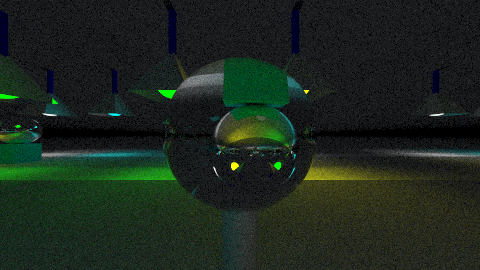

# Aufgabe 8: Metall und Glas

Implementierung den Materialien Metall(Reflektion) und Glas(Brechung und Reflektion)

## Lösung

### 8.0: Allgemeines

Ich habe vorherige Implementierunge mit Patterns versehen. Unter anderem kann nun auf die ImageQuality und der ColorCalculation mit einer Factory
zugegriffen werden. Die Gamma Klasse ist nun privat und und nur die Sampling Klasse kann darauf zugreifen. Aus einigen Quellen habe ich mitbekommen, dass x*x performanter als Math.pow(x,2); ist. Jedoch nur bei der Quadrierung. Aus diesem Grund ersetzte ich die performantere Berechnung an sämtlichen Stellen.

### 8.0.1: Statische Helferklasse

Die Berechnung der Reflektion habe ich in eine statische Helferklasse "MaterialCalculationHelper" ausgelagert. Da diese Berechnung nicht nur, 
von dem reflektierende Material, sondern auch von dem Glasmaterial verwendet wird.

Das ist die Methode für die Reflektion: 

```java
	public static Vec3 reflect( Vec3 direction, Vec3 normal, double accuracy )
	{
		Vec3 reflectDirection = direction.sub( normal.scale( 2 * direction.scalarProduct( normal ) ) );
		// std accuracy = 0, no rough surface -> perfect reflecting
		Vec3 randomPoint = ZEROVEC;
		if ( accuracy != 0 )
		{
			randomPoint = getRandomPoint( accuracy );
			reflectDirection = reflectDirection.add( randomPoint.scale( accuracy ) );
			if ( reflectDirection.scalarProduct( normal ) < 0 )
			{
				// absorb ray
				return null;
			}
		}
		return reflectDirection.normalize();
	}
```

Der Parameter accuracy gibt dabei an, wie groß die Rauuigkeit sein soll. Ist der Wert 0, dann ist das Material perfekt reflektierend. Der Zufällige Punkt wird in einer neuen Methode berechnet:

```java
	public static Vec3 getRandomPoint( double accuracy )
	{
		double x;
		double y;
		double z;
		Vec3 randomPosition;
		int count = 0;
		while ( count++ < 100 )
		{
			x = ( Random.random() * 2. * accuracy ) - accuracy;
			y = ( Random.random() * 2. * accuracy ) - accuracy;
			z = ( Random.random() * 2. * accuracy ) - accuracy;
			randomPosition = new Vec3( x, y, z );
			
			if ( randomPosition.scalarProduct( randomPosition ) <= ( accuracy * accuracy ) )
			{
				return randomPosition;
			}
		}
		throw new RuntimeException( "too many tries" );
	}
```

Falls innerhalb von 100 Versuchen kein Zufälliger Punkt gefunden wird, dann bricht die Methode ab.


### 8.1: Poliertes Metall

Da die Helfermethoden allgemeiner geschrieben sind, kann man mithilfe der Argumente, selber auswählen, welches Material man haben möchte.
Dafür habe ich diverse Konstruktoren geschrieben. Alle greifen jedoch auf diesen hier zurück:

```java
	public ReflectiveMaterial( double accuracy, Vec3 emission, Vec3 albedo )
	{
		this.accuracy = accuracy;
		this.color = emission;
		this.albedo = albedo;
	}
```

Bei dem Standardkonstruktor werden Standardwerte eingetragen. Der Standardwert für accuracy ist 0, für Emission (1,1,1) und albedo (0,0,0).
Möchte man also ein poliertes Material erzeugen, dann wählt man keine Argumente aus.

### 8.2: Angeschliffenes Metall

Hier kann man auch auf die verschiedenen Konstruktoren zurückgreifen und den Wert für die accuracy auf den gewünschten Wert setzen.


### 8.3: Glas

Im Konstruktor des Materials, gibt man an, welches Material dargestellt werden soll. Für die Dichte der Materialien gibt es ein Enum, welches Luft, Wasser, Glas und Diamant beinhaltet. Standardmäßig befindet sich die Umgebung in dem Material Luft. Bei Bedarf kann dieser Wert auch über die ImageCreator Klasse geändert werden.

Um den Zerstreuungsstrahl zu berechnen, wird die Normale aus dem Hit und die Richtung aus dem Ray benötigt. Zuerst muss geprüft werden, ob der Strahl außerhalb des Körpers ist. Ist das der Fall, dann muss die Normale negiert und die Dichte2 durch die Dichte1 geteilt werden. Als nächstes wird überprüft, ob bei der Brechung ein totaler Winkel entsteht. Der totale Winkel entsteht, wenn die Determinante des Brechungsalghorithmus negativ ist. Wenn ein totaler Winkel entsteht, dann wird nur reflektiert. Falls nicht wird per Zufall entschieden, ob doch reflektiert wird oder gebrochen wird. Der Zufall wird beeinflusst von dem Schlick-Alghorithmus. 

```java
	@Override
	public Ray getScatteredRay( Hit hit, Ray ray )
	{
		Vec3 normal = hit.surfaceNormal;
		double densityIndex = ImageCreator.DEFAULTDENSITY.value() / density.value();
		if ( normal.scalarProduct( ray.direction ) > 0 )
		{
			// ray is from outside
			normal = normal.scale( -1 );
			densityIndex = density.value() / ImageCreator.DEFAULTDENSITY.value();
		}
		
		double scalarProduct = normal.scalarProduct( ray.direction );
		if ( isRefract( densityIndex, scalarProduct ) )
		{
			// has to negate scalarProduct for this calculation
			double schlicks = schlick( ray.direction, normal, -scalarProduct );
			if ( schlicks < Random.random() )
			{
				return new Ray( hit.position, refract( ray.direction, normal, densityIndex, scalarProduct ), 0.001,
						Double.POSITIVE_INFINITY );
			}
		}
		Vec3 reflect = MaterialCalculationHelper.reflect( ray.direction, normal, accuracy );
		if ( reflect == null )
		{
			return null;
		}
		return new Ray( hit.position, reflect, 0.001, Double.POSITIVE_INFINITY );
	}
```

Aufgabe 7.4: Ansichten einer Szene





## Quellen
