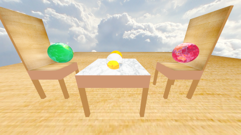
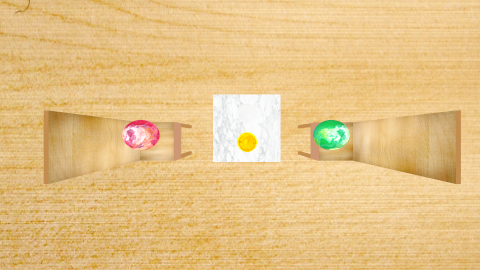
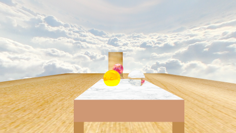

# Aufgabe 9: Wolken am Himmel

Implementierung von Texturierungsmöglichkeiten bei Materialen

## Lösung

### 9.1: Texturen

Das Textur Interface besteht aus einer Methode, die je nach Texturimplementierung anders implementiert ist. 

```java
public interface Texture
{
	Vec3 sample( Vec3 uv );
}
```

Um dieses Interface einzubinden, musste ich den vorherigen Code an unterschiedlichen Stellen abändern. Zum einen werden die Texturkorrdinaten, welche in dem Bereich von (0,0) bis (1,1) liegen, in den jeweiligen Shape-Implementierungen festgelegt. Die berechneten Texturkoordinaten werden im Hit mitgegeben. In den Implementierungen der Materialien gibt man nun nicht mehr direkt den Farbvektor an, sondern eine neue Textur. Damit konstante Farben dargestellt werden können, gibt es die ConstantTexture. Sie wird mit einem Farbvektor injeziert, der immer zurückgegeben wird, egal wie die ankommenden Texturkoordinaten sind. 

```java
public class ConstantTexture implements Texture
{
	
	private Vec3 color;
	
	public ConstantTexture( Vec3 color )
	{
		this.color = color;
	}
	
	@Override
	public Vec3 sample( Vec3 uv )
	{
		return color;
	}
}
```

Für die Bildtextur, habe ich die Klasse von Hr. Tramberend leicht abgeändert und die "Umkehrung" der Gammakorrektur in den Konstruktor eingebaut. Die entsprechende statische Methode ist in der Gammakorrektur-Klasse definiert. Der Zugriff erfolgt jedoch über die ImageCreator Klasse, da die Zielklasse von außen nicht sichtbar ist. Die Methode ist statisch, weil die Bilder vor dem Sampling konvertiert werden sollen und die Methode geht Pixel für Pixel durch die Bildrepräsentation und verändert den Farbwert mit dem umgedrehten Gamma-Wert. Da manche Bilder viel Zeit beim konvertieren in Anspruch nehmen, kann man ein flag setzen, ob man es konvertieren möchte oder nicht. Zum testen ist das praktisch. Die Bildtextur nimmt einen String, wo das Bild lokalisiert ist und die sample Methode leitet an die sample Methode des ImageTextur weiter.

```java
	public ImageTexture( String filename, boolean gammaCorrection ) throws IOException
	{
		image = ImageIO.read( new File( filename ) );
		width = image.getWidth();
		height = image.getHeight();
		
		if ( gammaCorrection )
		{
			System.out.printf( "%s Bild " + filename + " wird gammakorregiert.%n",
					TimeFormatter.getActualFormatTime() );
			long currentTime = System.currentTimeMillis();
			image = ImageCreator.gammacorrectBufferedImage( image, 1 / 2.2 );
			
			TimeObject time = new TimeObject( currentTime );
			System.out.printf( "%s Textur wurde erfolgreich gammakorregiert in %s: %.3f%n",
					TimeFormatter.getActualFormatTime(), time.getUnit(), time.getTime() );
		}
	}
```

 Auch Transformationen sind mit der Textur möglich. Dafür gibt es einen Wrapper, der ebenfalls das Textur Interface implementiert. Im Konstruktor wird eine Textur und eine Transformation übergeben. Wird nun die sample Methode aufgerufen, werden zuerst die Texturkorrdinaten transformiert und danach die sample Methode der Textur mit den transformierten Texturkorrdinaten aufgerufen. 


```java
public class TransformationTexture implements Texture
{
	
	private Texture texture;
	private Mat4 matrix;
	
	public TransformationTexture( Texture texture, Mat4 matrix )
	{
		this.texture = texture;
		this.matrix = matrix;
	}
	
	@Override
	public Vec3 sample( Vec3 uv )
	{
		Vec3 transformed = matrix.transformPoint( uv );
		double c = repeated( transformed.x );
		double d = repeated( transformed.y );
		
		if ( texture instanceof PictureTexture )
		{
			transformed = new Vec3( c, 1 - d, 0 );
		}
		else
		{
			transformed = new Vec3( c, d, 0 );
		}
		return texture.sample( transformed );
	}
	
	private double repeated( double x )
	{
		return Math.abs( x % 1.0 );
	}
	
}
```

Die Texturkoordinaten der Sphere lassen sich mit der folgenden Methode berechnen:

```java
public class UVHelper
{
	
	public static Vec3 calcUVSphereTexture( Vec3 vec )
	{
		double inclination = Math.acos( vec.y );
		double azimuth = Math.atan2( vec.x, vec.z );
		double u = ( azimuth + Math.PI ) / ( 2 * Math.PI );
		double v = inclination / Math.PI;
		
		return new Vec3( u, v, 0 );
	}
}
```

Da ich die Berechnung mehrmals brauche, ist die Berechnung ausgelagert in eine statische Klasse. Der übergebene Vektor ist die Normale. Letzendlich werden aus den kartesischen Koordinaten Kugelkoordinaten berechnet. und die beiden Winkel sind die Texturkoordinaten. 
Die gleiche Berechnung wird auch für den Hintergund durchgeführt.

Die Berechnung der Texturkoordinaten für das Rechteck sieht folgendermaßen aus:

```java
	Vec3 textureCoords = new Vec3( ( position.x / width ) + .5, ( position.y / height ) + .5, 0 );
```

Hier befindet sich der Ursprung des Rechteckes in der Mitte der Breite und der Höhe.


```java
```


### 9.2: Ansichten einer Szene








## Quellen

Das sind meine verwendeten Texturen:  
http://www.freakcommander.de/wp-content/uploads/2012/12/ueber_den_wolken.jpg  
http://arsenal-s3.gomedia.us/wp-content/uploads/gma-texture-collection-01-wood-pack-01-hero-shot.jpg  
https://images-na.ssl-images-amazon.com/images/I/71mo3FAF5hL._SL1023_.jpg  
http://eoimages.gsfc.nasa.gov/images/imagerecords/73000/73580/world.topo.bathy.200401.3x5400x2700.jpg  