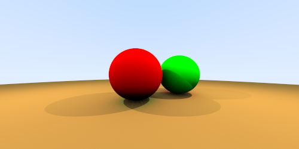
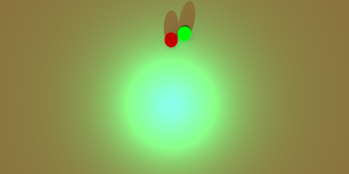
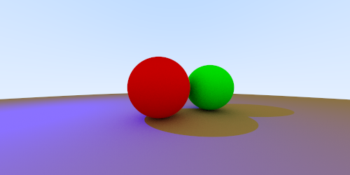

# Aufgabe 10: Licht und Schatten

Implementierung von Licht und Schatten

## Lösung

### 10.1: Punktlichtquellen

Um die Möglichkeit von Punktlichtquellen zu benutzen, implementierte ich das Interface Light mit dem Abstrakten Datentyp LightData:

```java
public interface Light
{
	
	LightData sample( World world, Vec3 fromPoint );
	
}

public class LightData
{
	
	public final Vec3 radiance;
	public final Vec3 intensity;
	
	public LightData( Vec3 radiance, Vec3 intensity )
	{
		this.radiance = radiance;
		this.intensity = intensity;
	}
	
}
```

Die Lichtquelle existiert nicht sichtbar in der Szene, man kann jedoch ihre Lichtstrahlen sehen und damit auch ungefähr erkennen, wo die Lichtquelle ist. Die Intensität der Lichtquelle kennt keine positiven Grenzen. 

Die Implementierung der Punktlichtquelle, prüft zuerst, ob der Trefferpunkt von der Lichtquelle aus überhaupt sichtbar ist. Wenn ja, dann wird in abhängigkeit von der Entfernung der Lichteinfluss berechnet. 

```java
	@Override
	public LightData sample( World world, Vec3 fromPoint )
	{
		LightData data = null;
		
		if ( world.isVisible( fromPoint, position ) )
		{
			Vec3 direction = position.sub( fromPoint );
			
			double squaredLength = direction.length * direction.length;
			Vec3 radiance = intensity.scale( 1 / squaredLength );
			data = new LightData( radiance, direction.normalize() );
		}
		return data;
	}
```

world.isVisible erzeugt ausgehend von der Trefferposition einen Strahl in Richtung der Lichtquellenposition und wird mit der Länge des Richtungsvektor begrenzt. Danach wird der Strahl mit der Szene geschnitten. Kommt aus der Rechnung ein Hit zurück, dann ist der Trefferpunkt nicht für die Szene sichtbar. 

Diese Methode habe ich einer neuen Klasse hinzugefügt, welche World heißt. Sie beinhaltet die Lichtquellen in einer Liste, sowie die Szene. 

In der Radiance Methode ist ein Methodenaufruf der calcLight-Methode dazugekommen: 


```java
private Vec3 calcLight( Hit hit )
	{
		Vec3 lightInfluens = new Vec3( 0, 0, 0 );
		if ( !hit.material.isSpecular() )
		{
			for ( Light lightSource : world.getLightSources() )
			{
				LightData lData = lightSource.sample( world, hit.position );
				
				if ( lData != null )
				{
					Vec3 adding = lData.radiance.scale( hit.surfaceNormal.scalarProduct( lData.intensity ) );
					lightInfluens = lightInfluens.add( adding );
				}
			}
		}
		return lightInfluens;
	}
```

Sie durchläuft alle Lichtquellen und berechnet deren Einfluss auf den Trefferpunkt.

### 10.2: Ansichten einer Szene








## Quellen
