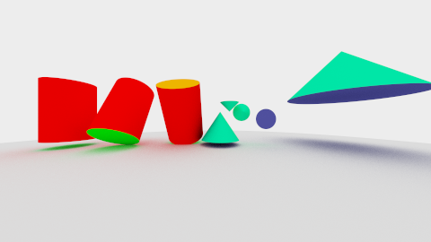

# Bonusaufgabe b01: Zylinder und Kegel

Implementierung des geschlossenen Zylinders und des abgeschlossenen Kegels

## Lösung

### 1.1:Zylinder

Der erste Entwurf für die Erzeugung des Zylinders ist einen hohlen Zylinder mit unendlicher Höhe, einem gegebenen Radius zu kreieren und anschließend eine Höhenbegrenzung anzuwenden. Der Ursprung des Zylinders bleibt dabei im Urprung des Weltkoordinatensystems. Um die Formel für den hohlen Zylinder zu bekommen, stellt man sich vor, der Zylinder sei aus ganz vielen einzelnen Scheiben zusammengesetzt und die Höhe begrenzt man mit einer Höhenangabe. Sodass man   
x²+z²=r²  
verwenden kann. Setzt man nun Formel in die Strahlgleichung und stellt das um, bekommt man eine quadratische Gleichung heraus. Zum lösen verwende ich die allgemeine Lösungsformel der Quadratischen Gleichungen:

```java
		double x0 = ray.origin.x - center.x;
		double z0 = ray.origin.z - center.z;
		
		double a = ( ray.direction.x * ray.direction.x ) + ( ray.direction.z * ray.direction.z );
		double b = 2 * ( ( x0 * ray.direction.x ) + ( z0 * ray.direction.z ) );
		double c = ( ( x0 * x0 ) + ( z0 * z0 ) ) - ( radius * radius );
		
		double diskriminante = ( b * b ) - ( 4 * a * c );
		if ( diskriminante < 0 )
		{
			return null;
		}
		
		double sqrt = Math.sqrt( diskriminante );
		double t0 = ( -b + sqrt ) / ( 2 * a );
		double t1 = ( -b - sqrt ) / ( 2 * a );
```

t0 und t1 sind nun 2 (ggf. unterschiedliche) Werte für die Lösung der quadratischen Gleichung. Für die folgende Betrachtung muss die Vorraussetzung erfüllt sein, dass t0 der nächste nicht-negative Wert ist.

```java
	if ( t0 > t1 )
	{
		double tmp = t0;
		t0 = t1;
		t1 = tmp;
	}	
```

t0 und t1 wird nun in die Strahlgleichung eingesetzt und man kann die y-Positionen entnehmen. Hier gibt es jetzt verschiedene Varianten, wie beide y-Positionen zusammenhängen können.
1. Der Zylinder wird nicht getroffen.  
2. Der Mantel wird getroffen.  
3. Die obere Platte wird getroffen.  
4. Die untere Platte wird getroffen. 


```java
		double y0 = ( ray.origin.y - center.y ) + ( t0 * ray.direction.y );
		double y1 = ( ray.origin.y - center.y ) + ( t1 * ray.direction.y );
		
		if ( noHit( y0, y1 ) )
		{
			return null;
		}
		else if ( ( y0 > height ) && ( y1 < height ) )
		{
			// hit upper plate
			double th = t0 + ( ( ( t1 - t0 ) * ( y0 - height ) ) / ( y0 - y1 ) );
			if ( th <= 0 )
			{
				return null;
			}
			
			Vec3 position = ray.pointAt( th );
			return new Hit( th, position, new Vec3( 0, 1, 0 ), materialTop, null );
		}
		else if ( ( y0 < -height ) && ( y1 > -height ) )
		{
			// hit lower plate
			double th = t0 + ( ( ( t1 - t0 ) * ( y0 + height ) ) / ( y0 - y1 ) );
			if ( th <= 0 )
			{
				return null;
			}
			
			Vec3 position = ray.pointAt( th );
			return new Hit( th, position, new Vec3( 0, -1, 0 ), materialBottom, null );
		}
		else
		{
			// hit body
			if ( t0 <= 0 )
			{
				return null;
			}
			
			Vec3 position = ray.pointAt( t0 );
			Vec3 normal = new Vec3( position.x, 0, position.z );
			return new Hit( t0, position, normal.normalize(), materialBody, null );
		}
```


### 1.2: Kegel

Die Vorgehensweise beim Kegel ist sehr ähnlich zu der des Kegels. Zuerst wird ein unendlicher hohler Körper mit gegebenen Radius kreiert, welcher anschließend in der Höhe begrenzt wird. Zusätzlich wird die Bodenplatte dazu kreiert. Beim Kegel unterscheidet sich die Formel ein kleines wenig, zu der des Kegels:  
x²+z²=y², yMin < y < yMax  
Nachdem die Formel in die Strahlgleichung eingesetz wurde, lässt sich auch hier eine quadratische Gleichung erstellen. Im folgenden Snippet ist die Implementierung der Formel mit der Allgemeinen Lösungsformel für die quadratischen Gleichungen zu sehen. Bei mir ist der Nullpunkt des Kegels in der Spitze. Somit befindet sich die eigentliche Höhe auf der Y-Achse bei Höhe * -1.

```java
		double originx = ray.origin.x;
		double originy = ray.origin.z;
		
		// dependency between height and radius
		double percentHeight = radius / height;
		double originz = ray.origin.y * percentHeight;
		double directionZWithPercentHeight = ray.direction.y * percentHeight;
		
		double a = ( ( ray.direction.x * ray.direction.x ) + ( ray.direction.z * ray.direction.z ) )
				- ( directionZWithPercentHeight * directionZWithPercentHeight );
		double b = 2 * ( ( ( originx * ray.direction.x ) + ( originy * ray.direction.z ) )
				- ( originz * ray.direction.y * percentHeight ) );
		double c = ( ( originx * originx ) + ( originy * originy ) ) - ( originz * originz );
		
		double diskriminante = Math.pow( b, 2 ) - ( 4 * a * c );
		// keine lösung der gleichung
		if ( diskriminante < 0 )
		{
			return null;
		}
		
		// zwei ergebniss der quadratischen gleichung t0 und t1
		double sqrt = Math.sqrt( diskriminante );
		double t0 = ( -b + sqrt ) / ( 2 * a );
		double t1 = ( -b - sqrt ) / ( 2 * a );	
```

Als nächstes wird überprüft, ob die t-Werte innerhalb der zulässigen Begrenzungen des Strahls liegen. Wenn beide zulässig sind, werden die t-Werte in die Strahlgleichung eingesetzt und die y-Werte der beiden Positionen miteinander verglichen. Negatives Unendlich wird zurückgegeben, wenn beide außerhalb der Begrenzungen oder eine Position treffen, die nicht angezeigt werden soll.

```java
	double result = checkBoundaries( t0, t1, ray );
	if ( Double.isInfinite( result ) )
	{
		// result is outside of boundaries
		return null;
	}	
```

Da in der Methode nur die y Position berechnet wird, wenn beide innerhalb der Begrenzungen sind, muss für alle anderen Fälle die y-Position überprüft werden. Die Trefferpunkte beiziehen sich auf den hohlen Körper, d.h. es kann ein Trefferpunkt existieren, welcher jedoch außerhalb der Höhenbegrenzung liegt. 

```java
	// height restriction with value of y
	Vec3 position = ray.pointAt( result );
	if ( ( position.y > 0 ) || ( position.y < -height ) )
	{
		return null;
	}
```

```java
```

Als nächstes wird überprüft, ob ein Treffer mit der Bodenplatte möglich ist. Dafür wird der t-Wert auf Höhe der Bodenplatte berechnet. Wenn nun der Trefferpunkt zu diesem t innerhalb der Radiusbegrenzung liegt und der Hit näher als der andere Treffer ist, dann wird der Boden getroffen.


```java
		// hit with bottom plate
		double tPlate = ( -height - ray.origin.y ) / ray.direction.y;
		if ( ray.isInsideOfBounds( tPlate ) )
		{
			Vec3 position3 = ray.pointAt( tPlate );
			double distance = ( position3.x * position3.x ) + ( position3.z * position3.z );
			if ( distance <= ( radius * radius ) )
			{
				if ( tPlate < result )
				{
					// hit is closer than body hit
					return new Hit( tPlate, ray.pointAt( tPlate ), NORMALBOTTOM, materialBottom, null );
				}
			}
		}
```

Ansonsten wird der Mantel des Kegels getroffen. Um die Normale zu berechnen, konvertiere ich, aufgrund der Höhe, den Trefferpunkt. Dann erstelle ich den Mittelpunkt der dazugehörigen Scheibe. Anschließend berechne ich den Winkel zischenTrefferpunkt und Nullpunkt (also unter normalen Umständen ist das die Höhe). Da die Normale 90° auf der Seitengerade des Kegels stehen muss, kann man die Eigenschaft eines gestreckten Winkels ausnutzen. Dadurch bekomme ich den Winkel zwischen Trefferpunkt und einem Punkt auf der Normale. 


```java
	private Vec3 calcNormale( Vec3 hitPoint )
	{
		// this calculation is for the height of the cone between 0 and height, but the cone lies between -height and 0,
		// so there is some transforming
		Vec3 newHitPoint = new Vec3( hitPoint.x, height + hitPoint.y, hitPoint.z );
		Vec3 center = new Vec3( 0, newHitPoint.y, 0 );
		
		// finding the angle between the normal and the line which contains center and hitPoint
		double length = center.sub( newHitPoint ).length;
		double alpha = Math.atan( ( height - center.y ) / length );
		
		// calculate the difference on y axis between the normalPoint and center
		double heightDifference = Math.tan( Math.toRadians( 90 ) - alpha ) * length;
		
		// converting back to cone corrdinates
		double centerDifferenceWithConeHeight = center.y - heightDifference - height;
		Vec3 point = new Vec3( 0, centerDifferenceWithConeHeight, 0 );
		return hitPoint.sub( point );
	}
```





## Quellen
woo4.me/wootracer/cylinder-intersection/  
http://www.cl.cam.ac.uk/teaching/1999/AGraphHCI/SMAG/node2.html#SECTION00023200000000000000  