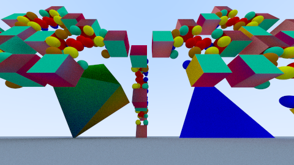

# Bonusaufgabe 3 Parallelisierung

Beschleunigung der Bilderzeugung durch Parallelisierung

## Lösung

### 3.1: Parallelisierungsparameter

Zur Parallelisierung der Bilderzeugung wähle ich die Teilung der Breite eines Bildes aus. Die Anzahl der zu benutzenden Kerne setze ich auf 4.
Mithilfe einer Hilfsfunktion bestimme ich, wie groß die einzelnen vertikalen Abschnitte sind. Dann erstelle ich die benötigten Runnables und lasse einen ThreadPool mit der festen Größe 4 die Threads verwalten.

### 3.2: Der Ablauf

Den ThreadPool erstelle im Konstruktor der ImageCreator Klasse.
```java
	threadCount = 4;
	threadPool = Executors.newFixedThreadPool(threadCount);
```

Zuerst wird überprüft, ob überhaupt eine Szene gesetzt wurde. Als nächstes werden die Reihen bestimmt, wo ein Runnable anfängt und wo dieser aufhört. Die Länge des rangeArray gibt aufschluss über die Anzahl der Runnables.
Die Klasse ThreadData ist ein abstrakter Datentyp und sammelt die benötigten Daten für ein Runnable. Die Anfangs- und Endreihen werden für jeden neuen Runnable einzeln gesetzt. Danach wird das Runnable dem ThreadPool zur Ausführung
übergeben. Um auf das Ende aller Runnables zu warten, erstelle ich ein CountDownLatch und gebe diesen die Anzahl der insgesamt zu erledigen Runnables mit. Ist ein Runnable fertig zählt es dieses CountDownLatch um eins herunter.
Ist der CountDownLatch nun bei 0 angekommen wird der restliche Code der Methode ausgeführt.

```java
	public void startWithThreadPool() throws NoSceneException
	{
		checkScene();

		int[][] rangeArray = calcRanges();
		CountDownLatch latch = new CountDownLatch(rangeArray.length);
		long currentTime = System.currentTimeMillis();
		ThreadData data = new ThreadData(height, width, sampling, imageQuality);
		for ( int i = 0; i < rangeArray.length; i++ )
		{
			data.setStart(rangeArray[i][0]);
			data.setEnd(rangeArray[i][1]);
			CalculationRunnable run = new CalculationRunnable(data, latch);
			threadPool.execute(run);
		}

		// wait until every runnable has finished
		try
		{
			latch.await();
		} catch( InterruptedException e )
		{
			e.printStackTrace();
		}

		TimeObject time = new TimeObject(currentTime);
		System.out.printf("%s Insgesamt benötigte %s: %.3f%n%n", TimeFormatter.getFormatTime(), time.getUnit(),
				time.getTime());
	}
```


### 3.3: Die Bestimmung der Daten für ein Runnable 

Die Methode bestimmt die Start- und Endreihen der Runnables und speichert die Begrenzungen in einem Array ab.
Die Vorgehensweise ist folgende:

Ausgehend von einer Standardanzahl an Runnables wird geprüft, ob alle Runnables eine gleiche Anzahl an Reihen bekommen würden. Ist dies der Fall, umfasst ein Bereich "width / count" Reihen. Dabei ist count die Variable für die aktuelle Anzahl an
Runnables. Ist sie nicht gleichmäßig wird count dekrementiert und die Überprüfung beginnt von neuem. Mindestens jeder Thread sollte einen Bereich abbekommen, deswegen tritt ab der Bedingung, dass count <= die Anzahl der aktuellen Threads ist, ein,
dass der Rest berechnet wird und bis dahin die Bereiche gerecht aufgeteilt werden. Ein neuer Runnable bekommt den Rest zugeteilt.


```java
		private int[][] calcRanges()
	{
		// calculates the ranges(start, end) from the runnables
		int start = 0;
		int count = 10;
		int end = 0;
		int rest = 0;
		boolean loop = true;
		while ( loop )
		{
			if ( width % count == 0 )
			{
				loop = false;
				end = width / count;
			}
			else
			{
				count--;
				// at least every thread have one runnable
				if ( count <= threadCount )
				{
					loop = false;
					rest = width % count;
					end = (width - rest) / count;
				}
			}
		}

		int[][] array = new int[rest == 0 ? count : count + 1][2];
		for ( int i = 0; i < (rest == 0 ? array.length : array.length - 1); i++ )
		{
			array[i][0] = start + (end * i);
			array[i][1] = end * (i + 1);
		}

		// calculate ranges from last part with rest
		if ( rest != 0 )
		{
			array[count][0] = array[count - 1][1];
			array[count][1] = array[count - 1][1] + rest;
		}
		return array;
	}
```

### 3.4: Das Runnable

Neben dem Konstruktor, wo lediglich eine Parameter Injection passiert, gibt es die run-Methode. 

Um den Status des Runnable anzeigen zu lassen, gebe ich an wie oft eine Ausgabe passieren soll. Die Anzahl ist in der Variable OUTPUTFREQUENCE angegeben. Ist nun eine Stufe der Frequenz erreicht, wird der aktuelle Fortschritt in Prozent angezeigt
und das Intervall wird auf die nächste Stufe der Frequenz gesetzt. Das Intervall berechnet sich, indem die Anzahl der zu bearbeitenden Reihen, unabhängig von der Start- und Endreihe, durch die OUTPUTFREQUENCE geteilt werden. 
In der doppelten for-Schleife ist nun die eigentliche Berechnung des Raytracers. Ist das Runnable am Ende angekommen wird das CountDownLatch um eins verringert und es wird ein Log erstellt. In diesem steht die benötigte Zeit und auch,
wie viel Prozent von dem aktuellen Bild schon bereits fertig ist.

```java
	@Override
	public void run()
	{
		// calculate intervall for displaying option
		int numOfRows = end - start;
		int rowsBetweenIntervalls = numOfRows / OUTPUTFREQUENCE;
		int intervall = rowsBetweenIntervalls + start;
		long startTime = System.currentTimeMillis();
		StringBuilder b = new StringBuilder(TimeFormatter.getFormatTime());
		b.append(" start: ").append(start).append(" until: ").append(end).append(" rows: ").append(numOfRows);
		System.out.println(b);
		for ( int x = start; x != end; x++ )
		{
			for ( int y = 0; y != height; y++ )
			{
				Vec3 color = sampling.stratifiedSampling(x, y);
				color = GammaCorrection.correct(color);
				imageQuality.setPixel(x, y, color);
			}
			if ( x == intervall )
			{
				// runnable reaches next interval -> display status
				TimeObject time = new TimeObject(startTime);
				System.out.printf("%s %s %.0f%% in %.3f %s%n", TimeFormatter.getFormatTime(),
						Thread.currentThread().getName(), ((x - start) / (double) numOfRows) * 100.0, time.getTime(),
						time.getUnit());
				intervall += rowsBetweenIntervalls;
			}
		}
		latch.countDown();
		TimeObject time = new TimeObject(startTime);
		System.out.printf("%s %s Benötigte %s: %.3f - vom gesamten Bild fertig: %s%%%n", TimeFormatter.getFormatTime(),
				Thread.currentThread().getName(), time.getUnit(), time.getTime(),
				(((numOfRunnables - (int) (latch.getCount())) / numOfRunnables) * 100));
	}
```

### 3.5: Logging

Um den Status jedes Runnables bzw. Bildes festzustellen, gebe ich an bestimmten Stellen eine Ausgabe in der Console aus. Das TimeObject berechnet zu einer gegebenen Zeit die Differenz zur aktuellen
Zeit aus und rechnet diese in Sekunden bzw. Minuten bzw. Stunden um. Die Klasse TimeFormatter zeigt die Stunden, Minuten und Sekunden in diesem Format an: "HH.mm.ssss".
Dabei wird bei keinem Parameter die aktuelle Zeit angezeigt oder ansonsten die Zeit des übergebenen Paramteres.


### 3.6: Benchmark Test mit Log

Die verwendete Szene ist folgende: 



Ich habe das Bild 2 Mal erzeugen lassen.
1. mit einem Thread            --> Benötigte Zeit: 49,090 Minuten = T1
2. mit dem ThreadPool(4 Kerne) --> Benötigte Zeit: 20,863 Minuten

Das optimale Verhältnis würde also T1 / 4 = 12,2725 Minuten entsprechen. Das Verhältnis von 25% wird leider nicht erfüllt. Die ThreadPool-Variante benötigt 42,5% der Zeit von T1.

Hier ist der ausführliche Log zu den Erzeugungen der 2 Varianten:  
"09.03.0009 start: 96 until: 144 rows: 48   
09.03.0009 start: 48 until: 96 rows: 48   
09.03.0009 start: 0 until: 48 rows: 48  
09.03.0009 start: 144 until: 192 rows: 48  
09.05.0004 pool-1-thread-1 25% in 1,928 Minuten  
09.05.0018 pool-1-thread-2 25% in 2,162 Minuten  
09.05.0050 pool-1-thread-4 25% in 2,691 Minuten  
09.05.0054 pool-1-thread-3 25% in 2,763 Minuten  
09.07.0004 pool-1-thread-1 50% in 3,914 Minuten  
09.07.0008 pool-1-thread-2 50% in 3,993 Minuten  
09.08.0006 pool-1-thread-4 50% in 4,952 Minuten  
09.08.0048 pool-1-thread-3 50% in 5,656 Minuten  
09.08.0059 pool-1-thread-2 75% in 5,839 Minuten  
09.09.0006 pool-1-thread-1 75% in 5,956 Minuten  
09.10.0019 pool-1-thread-4 75% in 7,178 Minuten  
09.10.0052 pool-1-thread-2 Benötigte Minuten: 7,724 - vom gesamten Bild fertig: 10.0%  
09.10.0052 start: 192 until: 240 rows: 48  
09.11.0001 pool-1-thread-1 Benötigte Minuten: 7,871 - vom gesamten Bild fertig: 20.0%  
09.11.0001 start: 240 until: 288 rows: 48  
09.11.0043 pool-1-thread-3 75% in 8,570 Minuten  
09.12.0008 pool-1-thread-4 Benötigte Minuten: 8,987 - vom gesamten Bild fertig: 30.0%  
09.12.0008 start: 288 until: 336 rows: 48  
09.12.0018 pool-1-thread-1 25% in 1,288 Minuten  
09.12.0043 pool-1-thread-2 25% in 1,846 Minuten  
09.13.0034 pool-1-thread-1 50% in 2,543 Minuten  
09.13.0037 pool-1-thread-4 25% in 1,476 Minuten  
09.14.0004 pool-1-thread-2 50% in 3,191 Minuten  
09.14.0010 pool-1-thread-3 Benötigte Minuten: 11,020 - vom gesamten Bild fertig: 40.0%  
09.14.0010 start: 336 until: 384 rows: 48  
09.14.0049 pool-1-thread-1 75% in 3,802 Minuten  
09.15.0033 pool-1-thread-4 50% in 3,411 Minuten  
09.16.0001 pool-1-thread-1 Benötigte Minuten: 5,004 - vom gesamten Bild fertig: 50.0%  
09.16.0001 start: 384 until: 432 rows: 48  
09.16.0014 pool-1-thread-2 75% in 5,367 Minuten  
09.16.0041 pool-1-thread-3 25% in 2,511 Minuten  
09.17.0051 pool-1-thread-4 75% in 5,713 Minuten  
09.18.0026 pool-1-thread-2 Benötigte Minuten: 7,568 - vom gesamten Bild fertig: 60.0%  
09.18.0026 start: 432 until: 480 rows: 48  
09.18.0032 pool-1-thread-1 25% in 2,520 Minuten  
09.19.0003 pool-1-thread-3 50% in 4,881 Minuten  
09.19.0059 pool-1-thread-4 Benötigte Minuten: 7,843 - vom gesamten Bild fertig: 70.0%  
09.20.0021 pool-1-thread-2 25% in 1,906 Minuten  
09.20.0035 pool-1-thread-1 50% in 4,569 Minuten  
09.21.0001 pool-1-thread-3 75% in 6,853 Minuten  
09.21.0039 pool-1-thread-2 50% in 3,213 Minuten  
09.22.0013 pool-1-thread-1 75% in 6,192 Minuten  
09.22.0045 pool-1-thread-3 Benötigte Minuten: 8,582 - vom gesamten Bild fertig: 80.0%  
09.22.0059 pool-1-thread-2 75% in 4,538 Minuten  
09.23.0029 pool-1-thread-1 Benötigte Minuten: 7,471 - vom gesamten Bild fertig: 90.0%  
09.24.0001 pool-1-thread-2 Benötigte Minuten: 5,571 - vom gesamten Bild fertig: 100.0%  
09.24.0001 Insgesamt benötigte Minuten: 20,863  
  
09.24.0001 Wrote image: doc/test/b_00.png   

Reihe: 0  
Reihe: 1  
Reihe: 2  
Reihe: 3  
Reihe: 4  
Reihe: 5  
Reihe: 6  
Reihe: 7  
Reihe: 8  
Reihe: 9  
Reihe: 10  
Reihe: 11  
Reihe: 12  
Reihe: 13  
Reihe: 14  
Reihe: 15  
Reihe: 16  
Reihe: 17  
Reihe: 18  
Reihe: 19  
Reihe: 20  
Reihe: 21  
Reihe: 22  
Reihe: 23  
Reihe: 24  
Reihe: 25  
Reihe: 26  
Reihe: 27  
Reihe: 28  
Reihe: 29  
Reihe: 30  
Reihe: 31  
Reihe: 32  
Reihe: 33  
Reihe: 34  
Reihe: 35  
Reihe: 36  
Reihe: 37  
Reihe: 38  
Reihe: 39  
Reihe: 40  
Reihe: 41  
Reihe: 42  
Reihe: 43  
Reihe: 44  
Reihe: 45  
Reihe: 46  
Reihe: 47  
Reihe: 48  
Reihe: 49  
Reihe: 50  
Reihe: 51  
Reihe: 52  
Reihe: 53  
Reihe: 54  
Reihe: 55  
Reihe: 56  
Reihe: 57  
Reihe: 58  
Reihe: 59  
Reihe: 60  
Reihe: 61  
Reihe: 62  
Reihe: 63  
Reihe: 64  
Reihe: 65  
Reihe: 66  
Reihe: 67  
Reihe: 68  
Reihe: 69  
Reihe: 70  
Reihe: 71  
Reihe: 72  
Reihe: 73  
Reihe: 74  
Reihe: 75  
Reihe: 76  
Reihe: 77  
Reihe: 78  
Reihe: 79  
Reihe: 80  
Reihe: 81  
Reihe: 82  
Reihe: 83  
Reihe: 84  
Reihe: 85  
Reihe: 86  
Reihe: 87  
Reihe: 88  
Reihe: 89  
Reihe: 90  
Reihe: 91  
Reihe: 92  
Reihe: 93  
Reihe: 94  
Reihe: 95  
Reihe: 96  
Reihe: 97  
Reihe: 98  
Reihe: 99  
Reihe: 100  
Reihe: 101  
Reihe: 102  
Reihe: 103  
Reihe: 104  
Reihe: 105  
Reihe: 106  
Reihe: 107  
Reihe: 108  
Reihe: 109  
Reihe: 110  
Reihe: 111  
Reihe: 112  
Reihe: 113  
Reihe: 114  
Reihe: 115  
Reihe: 116  
Reihe: 117  
Reihe: 118  
Reihe: 119  
Reihe: 120  
Reihe: 121  
Reihe: 122  
Reihe: 123  
Reihe: 124  
Reihe: 125  
Reihe: 126  
Reihe: 127  
Reihe: 128  
Reihe: 129  
Reihe: 130  
Reihe: 131  
Reihe: 132  
Reihe: 133  
Reihe: 134  
Reihe: 135  
Reihe: 136  
Reihe: 137  
Reihe: 138  
Reihe: 139  
Reihe: 140  
Reihe: 141  
Reihe: 142  
Reihe: 143  
Reihe: 144  
Reihe: 145  
Reihe: 146  
Reihe: 147  
Reihe: 148  
Reihe: 149  
Reihe: 150  
Reihe: 151  
Reihe: 152  
Reihe: 153  
Reihe: 154  
Reihe: 155  
Reihe: 156  
Reihe: 157  
Reihe: 158  
Reihe: 159  
Reihe: 160  
Reihe: 161  
Reihe: 162  
Reihe: 163  
Reihe: 164  
Reihe: 165  
Reihe: 166  
Reihe: 167  
Reihe: 168  
Reihe: 169  
Reihe: 170  
Reihe: 171  
Reihe: 172  
Reihe: 173  
Reihe: 174  
Reihe: 175  
Reihe: 176  
Reihe: 177  
Reihe: 178  
Reihe: 179  
Reihe: 180  
Reihe: 181  
Reihe: 182  
Reihe: 183  
Reihe: 184  
Reihe: 185  
Reihe: 186  
Reihe: 187  
Reihe: 188  
Reihe: 189  
Reihe: 190  
Reihe: 191  
Reihe: 192  
Reihe: 193  
Reihe: 194  
Reihe: 195  
Reihe: 196  
Reihe: 197  
Reihe: 198  
Reihe: 199  
Reihe: 200  
Reihe: 200  
Reihe: 201  
Reihe: 202  
Reihe: 203  
Reihe: 204  
Reihe: 205  
Reihe: 206  
Reihe: 207  
Reihe: 208  
Reihe: 209  
Reihe: 210  
Reihe: 211  
Reihe: 212  
Reihe: 213  
Reihe: 214  
Reihe: 215  
Reihe: 216  
Reihe: 217  
Reihe: 218  
Reihe: 219  
Reihe: 220  
Reihe: 221  
Reihe: 222  
Reihe: 223  
Reihe: 224  
Reihe: 225  
Reihe: 226  
Reihe: 227  
Reihe: 228  
Reihe: 229  
Reihe: 230  
Reihe: 231  
Reihe: 232  
Reihe: 233  
Reihe: 234  
Reihe: 235  
Reihe: 236  
Reihe: 237  
Reihe: 238  
Reihe: 239  
Reihe: 240  
Reihe: 241  
Reihe: 242  
Reihe: 243  
Reihe: 244  
Reihe: 245  
Reihe: 246  
Reihe: 247  
Reihe: 248  
Reihe: 249  
Reihe: 250  
Reihe: 251  
Reihe: 252  
Reihe: 253  
Reihe: 254  
Reihe: 255  
Reihe: 256  
Reihe: 257  
Reihe: 258  
Reihe: 259  
Reihe: 260  
Reihe: 261  
Reihe: 262  
Reihe: 263  
Reihe: 264  
Reihe: 265  
Reihe: 266  
Reihe: 267  
Reihe: 268  
Reihe: 269  
Reihe: 270  
Reihe: 271  
Reihe: 272  
Reihe: 273  
Reihe: 274  
Reihe: 275  
Reihe: 276  
Reihe: 277  
Reihe: 278  
Reihe: 279  
Reihe: 280  
Reihe: 281  
Reihe: 282  
Reihe: 283  
Reihe: 284  
Reihe: 285  
Reihe: 286  
Reihe: 287  
Reihe: 288  
Reihe: 289  
Reihe: 290  
Reihe: 291  
Reihe: 292  
Reihe: 293  
Reihe: 294  
Reihe: 295  
Reihe: 296  
Reihe: 297  
Reihe: 298  
Reihe: 299  
Reihe: 300  
Reihe: 301  
Reihe: 302  
Reihe: 303  
Reihe: 304  
Reihe: 305  
Reihe: 306  
Reihe: 307  
Reihe: 308  
Reihe: 309  
Reihe: 310  
Reihe: 311  
Reihe: 312  
Reihe: 313  
Reihe: 314  
Reihe: 315  
Reihe: 316  
Reihe: 317  
Reihe: 318  
Reihe: 319  
Reihe: 320  
Reihe: 321  
Reihe: 322  
Reihe: 323  
Reihe: 324  
Reihe: 325  
Reihe: 326  
Reihe: 327  
Reihe: 328  
Reihe: 329  
Reihe: 330  
Reihe: 331  
Reihe: 332  
Reihe: 333  
Reihe: 334  
Reihe: 335  
Reihe: 336  
Reihe: 337  
Reihe: 338  
Reihe: 339  
Reihe: 340  
Reihe: 341  
Reihe: 342  
Reihe: 343  
Reihe: 344  
Reihe: 345  
Reihe: 346  
Reihe: 347  
Reihe: 348  
Reihe: 349  
Reihe: 350  
Reihe: 351  
Reihe: 352  
Reihe: 353  
Reihe: 354  
Reihe: 355  
Reihe: 356  
Reihe: 357  
Reihe: 358  
Reihe: 359  
Reihe: 360  
Reihe: 361  
Reihe: 362  
Reihe: 363  
Reihe: 364  
Reihe: 365  
Reihe: 366  
Reihe: 367  
Reihe: 368  
Reihe: 369  
Reihe: 370  
Reihe: 371  
Reihe: 372  
Reihe: 373  
Reihe: 374  
Reihe: 375  
Reihe: 376  
Reihe: 377  
Reihe: 378  
Reihe: 379  
Reihe: 380  
Reihe: 381  
Reihe: 382  
Reihe: 383  
Reihe: 384  
Reihe: 385  
Reihe: 386  
Reihe: 387  
Reihe: 388  
Reihe: 389  
Reihe: 390  
Reihe: 391  
Reihe: 392  
Reihe: 393  
Reihe: 394  
Reihe: 395  
Reihe: 396  
Reihe: 397  
Reihe: 398  
Reihe: 399  
Reihe: 400  
Reihe: 401  
Reihe: 402  
Reihe: 403  
Reihe: 404  
Reihe: 405  
Reihe: 406  
Reihe: 407  
Reihe: 408  
Reihe: 409  
Reihe: 410  
Reihe: 411  
Reihe: 412  
Reihe: 413  
Reihe: 414  
Reihe: 415  
Reihe: 416  
Reihe: 417  
Reihe: 418  
Reihe: 419  
Reihe: 420  
Reihe: 421  
Reihe: 422  
Reihe: 423  
Reihe: 424  
Reihe: 425  
Reihe: 426  
Reihe: 427  
Reihe: 428  
Reihe: 429  
Reihe: 430  
Reihe: 431  
Reihe: 432  
Reihe: 433  
Reihe: 434  
Reihe: 435  
Reihe: 436  
Reihe: 437  
Reihe: 438  
Reihe: 439  
Reihe: 440  
Reihe: 441  
Reihe: 442  
Reihe: 443  
Reihe: 444  
Reihe: 445  
Reihe: 446  
Reihe: 447  
Reihe: 448  
Reihe: 449  
Reihe: 450  
Reihe: 451  
Reihe: 452  
Reihe: 453  
Reihe: 454  
Reihe: 455  
Reihe: 456  
Reihe: 457  
Reihe: 458  
Reihe: 459  
Reihe: 460  
Reihe: 461  
Reihe: 462  
Reihe: 463  
Reihe: 464  
Reihe: 465  
Reihe: 466  
Reihe: 467  
Reihe: 468  
Reihe: 469  
Reihe: 470  
Reihe: 471  
Reihe: 472  
Reihe: 473  
Reihe: 474  
Reihe: 475  
Reihe: 476  
Reihe: 477  
Reihe: 478  
Reihe: 479  
Benötigte Minuten: 49,090  
10.34.0005 Wrote image: doc/test/b_02.png"  


## Quellen

http://openbook.rheinwerk-verlag.de/javainsel9/javainsel_14_004.htm
