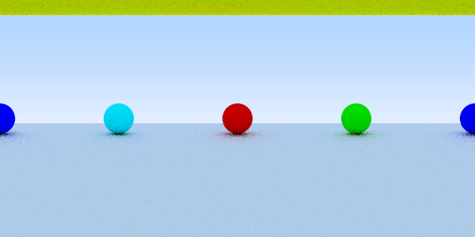

# Bonusaufgabe 4 - Street View Photo Sphere Kamera

Erzeugung eines 360° Bildes

**If you want to see the code, please switch the branch to 'images360'.**

## Lösung

### 4.1: Rectangularprojektion

Zur Erzeugung einers 360° Bildes, muss man sich vorstellen, dass die Camera an einem festen Standpunkt steht. Dies ist der Mittelpunkt einer Kugel, die einen Radius von 1 hat. Jetzt wandelt man die einkommenden x und y Koordinaten in Kugelkoordinaten um. Somit wickelt man die Kugelkoordianten auf ein Rechteck, welches das Bild darstellt ab. 

Die Implementierung des neuen Rays, der entlang der Kugelkoordinaten verläuft sieht folgendermaßen aus:


```java

	@Override
	public Ray generateRay( double x, double y, double lowerBound, double upperBound )
	{
		double widthAngle = ( x * 360. ) / width;
		double heightAngle = ( y * 180. ) / height;
		
		widthAngle = Math.toRadians( widthAngle );
		heightAngle = Math.toRadians( heightAngle );
		
		double c = Math.sin( heightAngle ) * Math.cos( widthAngle );
		double d = Math.sin( heightAngle ) * Math.sin( widthAngle );
		double e = Math.cos( heightAngle );
		
		Vec3 direction = new Vec3( c, e, d ).normalize();
		return new Ray( origin, transformation.get().transformDirection( direction ), lowerBound, upperBound );
	}	
```

### 4.2: Einbindung in den ImageCreator

Um die Einbindung in das bestehende Programm herzustellen, habe ich eine abstrakte Klasse Camera erstellt. Die PinholeCamera sowie die RectangularProjection implementieren diese. Bei der Erzeugung des ImageCreator wird automatisch die PinholeCamera erzeugt. Bei Bedarf kann das Kameramodell geändert werden. Dafür gibt es ein Enum, welches die Kameramodelle verwaltet. Die Erzeugung der Camera selber funktioniert über ein Factory Method Pattern.


### 4.3: Ansicht einer Szene

Die Szene besteht aus 6 Kugeln. Sie sind rund, um den Standpunkt mit gleichem Abstand verteilt. Die größte von allen ist die untere. Sie reprasentiert eine Erdkugel. Auf gleicher Höhe befindet sich vorne eine rote Kugel, hinten eine blaue Kugel, rechts eine grüne Kugel, links eine türkise Kugel, sowie oberhalb des Standpunktes eine gelbe Kugel. Die gelbe ist in der Rectangularprojektion ein Balken, da die Kugel oberhalb in jedem Grad der vorgestellten Kugel der Projektion sichtbar ist.



## Quellen
